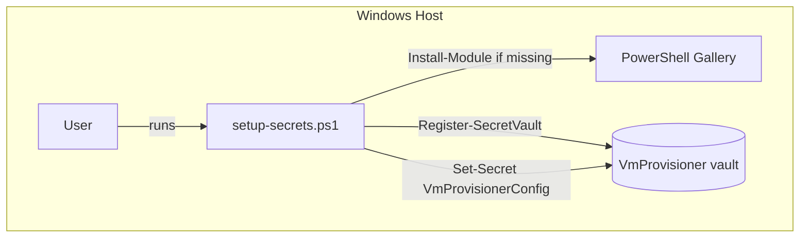
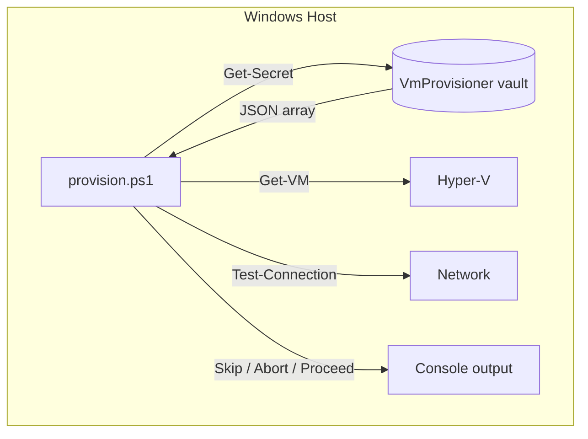
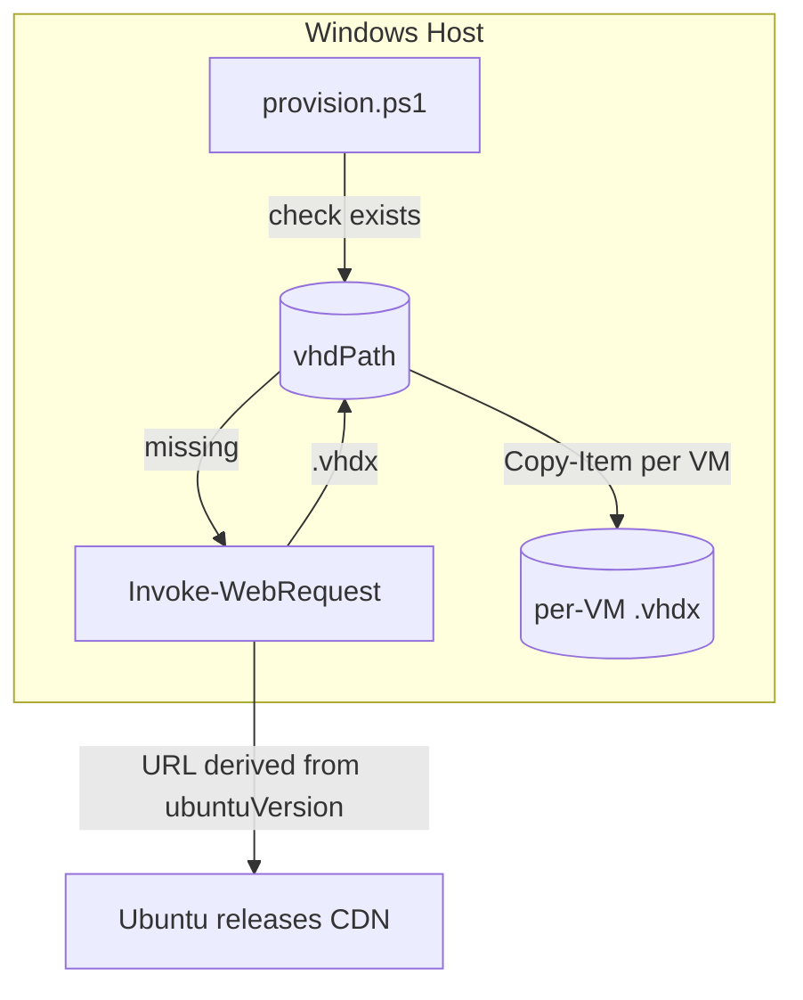
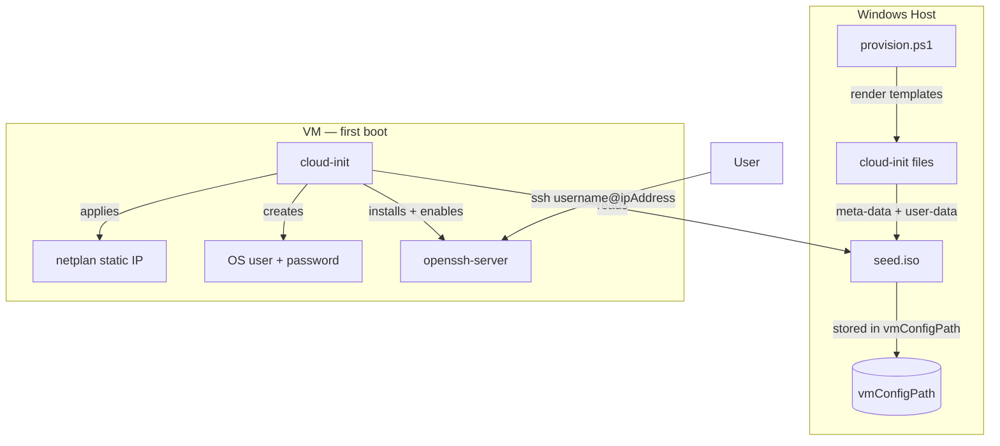
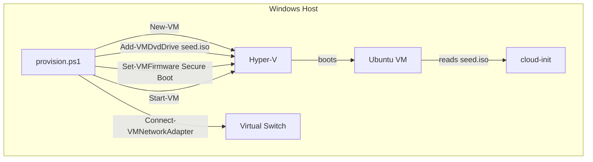
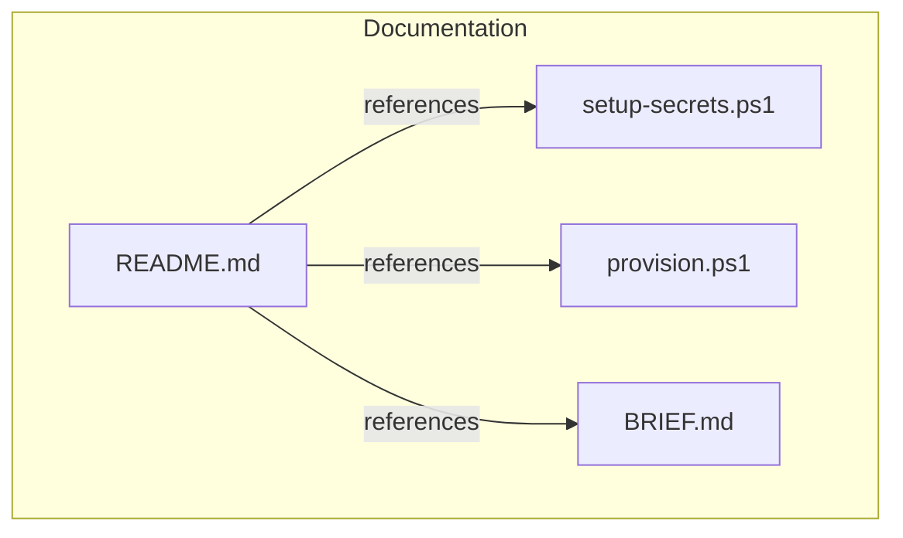

---
# Implementation Plan

## Index
- [Step 1 — Repo skeleton](#step-1--repo-skeleton)
- [Step 2 — setup-secrets.ps1](#step-2--setup-secretsps1)
- [Step 3 — provision.ps1: vault read + validation](#step-3--provisionps1-vault-read--validation)
- [Step 4 — provision.ps1: disk image acquisition](#step-4--provisionps1-disk-image-acquisition)
- [Step 5 — provision.ps1: cloud-init seed ISO](#step-5--provisionps1-cloud-init-seed-iso)
- [Step 6 — provision.ps1: VM creation](#step-6--provisionps1-vm-creation)
- [Step 7 — README.md](#step-7--readmemd)

---

## Step 1 — Repo skeleton

**What:** Create the directory structure and placeholder files.

```
hyper-v/
└── ubuntu/
    ├── provision.ps1       (empty)
    └── setup-secrets.ps1   (empty)
README.md                   (stub)
```

**Why:** Establishes the `hypervisor/guest-os/` convention from
[BRIEF.md](../../../BRIEF.md) before any code is written; every subsequent
step has a clear home.

---

## Step 2 — setup-secrets.ps1

**What:** Script that:
1. Installs `Microsoft.PowerShell.SecretManagement` +
   `Microsoft.PowerShell.SecretStore` if not already present.
2. Registers a `SecretStore` vault named `VmProvisioner` (no-prompt,
   password-protected or passwordless per user choice).
3. Accepts a JSON string (or path to a JSON file) and stores it as the
   `VmProvisionerConfig` secret.
4. Prints a confirmation and advises the user to run `provision.ps1`.

**Why:** Decouples sensitive config from the repo. Needs to exist and be
tested before `provision.ps1` can read from it.



---

## Step 3 — provision.ps1: vault read + validation

**What:** Opening section of `provision.ps1` that:
1. Reads the `VmProvisionerConfig` secret (JSON array).
2. Parses and validates required fields per VM entry.
3. Checks each VM name against existing Hyper-V VMs — skips if found.
4. Checks each `ipAddress` with a `Test-Connection` / ping sweep —
   aborts that entry if the IP is already in use.
5. Emits structured `Write-Host` / `Write-Warning` output for each decision.

**Why:** Idempotency and safety checks are the core value of the script;
implementing them first makes all subsequent steps testable in isolation.



---

## Step 4 — provision.ps1: disk image acquisition

**What:** For each VM entry that passes validation:
1. Derive the Ubuntu `.vhdx` download URL from `ubuntuVersion`.
2. If the base `.vhdx` already exists in `vhdPath`, skip download.
3. Otherwise download it (with progress output).
4. Copy (not move) the base image to a per-VM differencing or flat copy
   so the base stays reusable.

**Why:** Downloading a multi-GB image on every run would be wasteful; caching
the base image makes repeated provisioning fast.



---

## Step 5 — provision.ps1: cloud-init seed ISO

**What:** For each VM, generate:
- `meta-data` (instance-id, local-hostname)
- `user-data` covering:
  - OS user + hashed password
  - SSH server enabled (`openssh-server` installed via `packages:`)
  - Password SSH auth enabled (`ssh_pwauth: true`)
  - Netplan static IP config written under `/etc/netplan/`

Then pack them into a FAT-formatted ISO (`seed.iso`) using
`New-IsoFile` or `oscdimg.exe` (ships with Windows ADK / available via
`mkisofs` if installed), placed alongside the VM disk.

**Why:** Cloud-init is the only mechanism to inject user credentials and
network config into the Ubuntu cloud image without an interactive installer.
The seed ISO is mounted as a second drive; cloud-init reads it on first boot.
SSH must be configured here — the cloud image has `openssh-server` disabled
by default and the port is not open until cloud-init enables it.



---

## Step 6 — provision.ps1: VM creation

**What:** For each validated VM entry:
1. `New-VM` with the correct generation (Gen 2), memory, CPU, and vhd path.
2. Attach the seed ISO as a DVD drive.
3. Set Secure Boot template to `MicrosoftUEFICertificateAuthority`
   (required for Ubuntu Gen 2).
4. Connect to the specified virtual switch.
5. `Start-VM`.
6. Emit status output.

**Why:** This is the final assembly step — all prior steps feed into it.
Kept separate so the VM-creation logic is reviewable independently.



---

## Step 7 — README.md

**What:** Root `README.md` covering:
- Prerequisites (Hyper-V, PowerShell, modules, virtual switch) — note that
  **PS 5.1 (ships with Windows 11) is sufficient**; PS 7 is recommended but
  not required. State this explicitly so operators don't install PS 7
  unnecessarily.
- Quick start (setup-secrets → provision).
- JSON config reference (all fields, types, example) — including
  `sshPublicKey`.
- How to SSH into a provisioned VM.
- Idempotency and safety behaviour.
- Repo structure and extension guide.

**Why:** Required by [AGENTS.md](../../../AGENTS.md) (updated after each
step); also the primary onboarding document for anyone consuming this repo.


