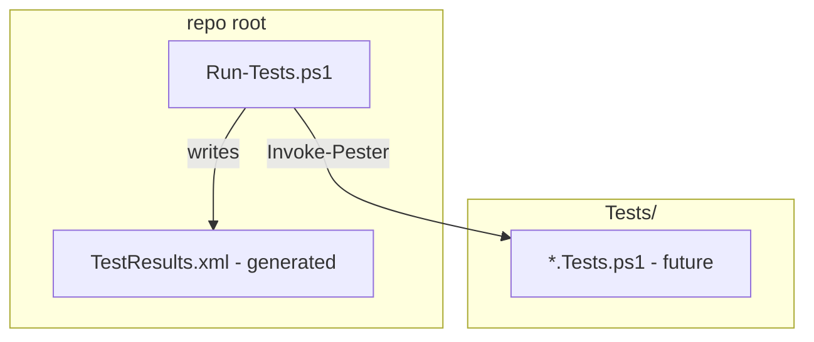
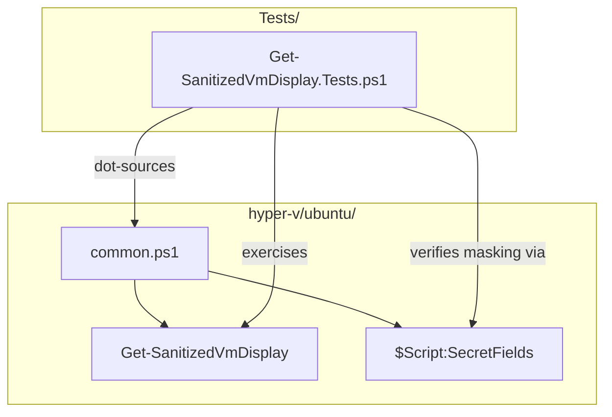
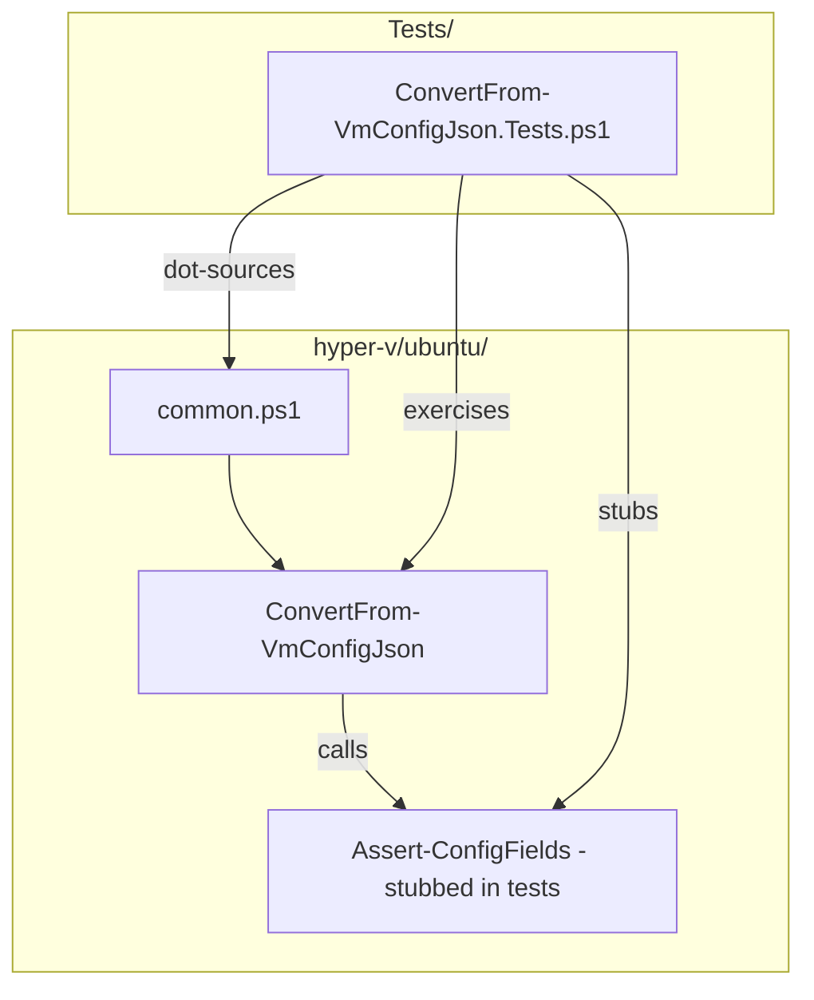

# Plan: Unit Test Coverage

See [problem.md](problem.md) for context and scope.

## Index
- [Step 1 - Run-Tests.ps1](#step-1---run-testsps1)
- [Step 2 - Get-SanitizedVmDisplay tests](#step-2---get-sanitizedvmdisplay-tests)
- [Step 3 - ConvertFrom-VmConfigJson tests](#step-3---convertfrom-vmconfigjson-tests)

---

## Step 1 - Run-Tests.ps1

**Why:** Entry point needed before any test files exist; mirrors
Infrastructure.Secrets exactly so the pattern is consistent across repos.

Add `Run-Tests.ps1` at the repo root. Auto-installs Pester 5 if absent,
runs everything under `Tests\`, writes `TestResults.xml`, exits non-zero
on failure.

---

## Step 2 - Get-SanitizedVmDisplay tests

**Why:** `Get-SanitizedVmDisplay` is the simplest pure function and the
easiest starting point; also covers the `$Script:SecretFields` list which
is a security-relevant constant.

Add `Tests/Get-SanitizedVmDisplay.Tests.ps1`. Dot-sources `common.ps1`.
No mocks needed - the function has no external dependencies.

Coverage:
| Case | What it checks |
|------|----------------|
| Password field is masked | Secret fields are replaced with `***` |
| Non-secret fields are preserved | Other values pass through unchanged |
| Multiple fields in correct order | All NoteProperties appear in output |
| VM with no secret fields | Returns object unchanged (no masking) |
| VM with only secret fields | All values masked |
| Secret field value is `$null` | `$null` value is still masked to `***`, not passed through |
| Empty object (no properties) | `Get-Member` returns nothing - must return empty object, not throw |
| Secret field name casing | `-in` is case-insensitive in PS - `'Password'` masks same as `'password'` |

---

## Step 3 - ConvertFrom-VmConfigJson tests

**Why:** This is the most logic-dense function in the repo: it parses JSON,
normalises PS 5.1's single-element array quirk, and validates every required
field. It is the primary guard against bad config reaching provision.ps1.

Add `Tests/ConvertFrom-VmConfigJson.Tests.ps1`. Dot-sources `common.ps1`.
Stubs `Assert-ConfigFields` in `BeforeAll` (so the Infrastructure.Secrets
module is not required).

Coverage:
| Case | What it checks |
|------|----------------|
| Valid JSON array, all fields present | Returns array of VM objects |
| Valid JSON - single object (PS 5.1 unwrap) | `@()` normalises to 1-element array |
| Invalid JSON string | Throws `"Invalid JSON: ..."` |
| Empty string `""` | `ConvertFrom-Json` throws - caught and re-thrown as `"Invalid JSON: ..."` |
| Empty JSON array `[]` | Throws `"Config must be a non-empty..."` |
| JSON is a scalar (e.g. `"hello"`) | `ConvertFrom-Json` succeeds but result is not an object - `Assert-ConfigFields` is called on a string, not a PSCustomObject; documents current behaviour |
| Missing required field | `Assert-ConfigFields` is called per VM (mock verifies) |
| Multiple VMs | Returns all objects; `Assert-ConfigFields` called once per VM |
| vmName present vs absent | Context string in `Assert-ConfigFields` call uses name or `(unknown)` |
| Second VM fails validation | Throws; first VM object was already emitted to pipeline - callers using `@()` receive an incomplete array. Test asserts the throw; documents the known partial-output behaviour as a caveat. |

