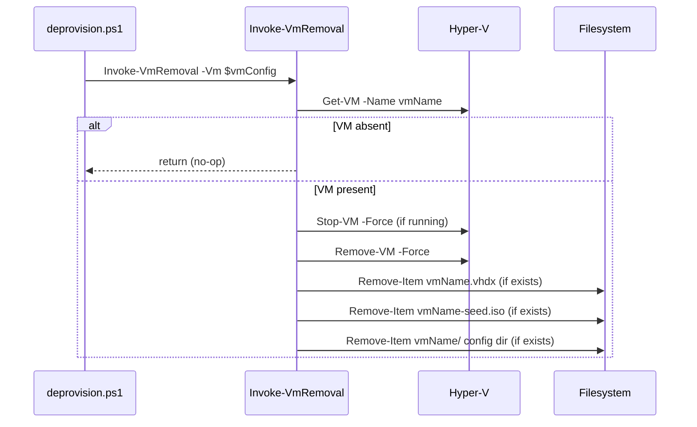
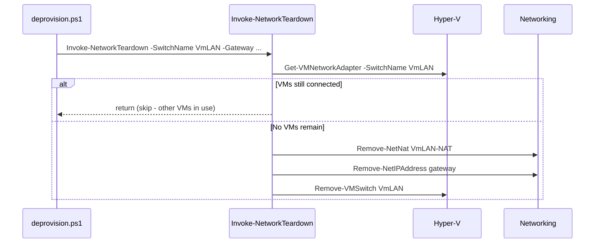

# Plan: VM Removal

## Index

- [Overview](#overview)
- [Target folder structure](#target-folder-structure)
- [Steps](#steps)
  - [Step 1 - Folder restructure](#step-1---folder-restructure)
  - [Step 2 - Invoke-VmRemoval](#step-2---invoke-vmremoval)
  - [Step 3 - Invoke-NetworkTeardown](#step-3---invoke-networkteardown)
  - [Step 4 - deprovision.ps1](#step-4---deprovisionps1)

---

## Overview

Add `deprovision.ps1` as the reverse of `provision.ps1`. The same vault
config drives both scripts. Two new helper functions handle the two
distinct concerns:

1. **Per-VM removal** (`Invoke-VmRemoval`) - stop, delete VM, delete
   per-VM VHDX, seed ISO, and config directory.
2. **Shared network teardown** (`Invoke-NetworkTeardown`) - remove NAT
   rule, host vNIC IP, and virtual switch - only when no VMs remain on
   `VmLAN`.

A folder restructure runs first to introduce top-level `common/`,
`up/`, and `down/` subfolders (with domain subfolders inside each),
mirroring the convention used in Infrastructure-Vm-Users and
Infrastructure-GitHubRunners.

See [problem.md](problem.md) for context and constraints.

---

## Target folder structure

```
hyper-v/ubuntu/
  provision.ps1          (updated dot-source paths)
  deprovision.ps1        (new)
  setup-secrets.ps1      (unchanged)
  common/
    config/
      ConvertFrom-VmConfigJson.ps1   (moved from config/)
      Get-SanitizedVmDisplay.ps1     (moved from config/)
  up/
    disk/
      Invoke-DiskImageAcquisition.ps1 (moved from disk/)
      Invoke-BaseImagePatch.ps1       (moved from disk/)
    network/
      setup-network.ps1              (moved from network/)
    seed/
      generate-seed-iso.ps1          (moved from seed/)
      iso.ps1                        (moved from seed/)
    vm/
      create-vm.ps1                  (moved from vm/)
  down/
    network/
      teardown-network.ps1           (new)
    vm/
      remove-vm.ps1                  (new)
Tests/
  common/
    config/
      ConvertFrom-VmConfigJson.Tests.ps1    (moved from Tests/)
      Get-SanitizedVmDisplay.Tests.ps1      (moved from Tests/)
  up/
    disk/
      Invoke-BaseImagePatch.Tests.ps1       (moved from Tests/)
      Invoke-DiskImageAcquisition.Tests.ps1 (moved from Tests/)
    network/
      Invoke-NetworkSetup.Tests.ps1         (moved from Tests/)
    seed/
      Invoke-SeedIsoGeneration.Tests.ps1    (moved from Tests/)
      New-SeedIso.Tests.ps1                 (moved from Tests/)
    vm/
      Invoke-VmCreation.Tests.ps1           (moved from Tests/)
  down/
    network/
      Invoke-NetworkTeardown.Tests.ps1      (new)
    vm/
      Invoke-VmRemoval.Tests.ps1            (new)
```

---

## Steps

### Step 1 - Folder restructure

**Why**: Introducing `up/` and `down/` as the primary split (with domain
subfolders inside each) makes the provision/deprovision boundary
explicit at the top level and mirrors the convention in
Infrastructure-Vm-Users (`reconcile/up/`, `reconcile/down/`) and
Infrastructure-GitHubRunners. Shared helpers move to `common/`.

**Changes**:

- Create `common/config/`, `up/disk/`, `up/network/`, `up/seed/`,
  `up/vm/`, `down/network/`, `down/vm/`.
- `git mv` all existing source files to their new paths (preserves
  history).
- Update all dot-source paths in `provision.ps1` and `setup-secrets.ps1`.
- Mirror all test file moves under `Tests/common/`, `Tests/up/`,
  updating dot-source paths inside each moved file.
- Update README repo structure section.

**Tests**: All existing tests must pass unchanged after the moves. No
new tests.

---

### Step 2 - Invoke-VmRemoval

**Why**: Encapsulates all per-VM destruction so `deprovision.ps1` stays
at the same abstraction level as `provision.ps1` - one call per VM,
caller owns nothing below that.

**File**: `down/vm/remove-vm.ps1`

**Behaviour**:
- Accept a single validated VM config object (same shape as produced by
  `ConvertFrom-VmConfigJson`).
- Check whether the VM exists in Hyper-V (`Get-VM -Name`).
  - If present: stop if running (`Stop-VM -Force`), then remove
    (`Remove-VM -Force`).
  - If absent: skip the Hyper-V steps and proceed directly to file
    cleanup. This ensures re-running after a partial failure (VM removed
    but files still present) retries the deletions rather than returning
    early and leaving artefacts behind.
- Delete the per-VM VHDX (`{vhdPath}/{vmName}.vhdx`) if it exists.
- Delete the seed ISO (`{vmConfigPath}/{vmName}-seed.iso`) if it exists.
  Absence is not an error - `provision.ps1` removes it after first boot.
- Delete the VM config directory (`{vmConfigPath}/{vmName}/`) if it
  exists (holds `.vmcx`, `.vmrs`, snapshots).

**File handle release**: `Remove-VM` returns before the Virtual Machine
Management Service (VMMS) fully releases its handles on the VHDX and
config directory. A `Remove-Item` immediately after would throw
`IOException: The process cannot access the file`. Each file deletion
must retry in a short loop (up to 5 attempts, 2-second intervals).
If the file is still locked after all retries, the function throws with
a clear message identifying which file could not be deleted. Re-running
the script after such a failure will skip the already-removed VM and
retry only the outstanding file deletions.

**Tests**: `Tests/down/vm/Invoke-VmRemoval.Tests.ps1`

Stub all Hyper-V and filesystem cmdlets (`Get-VM`, `Stop-VM`,
`Remove-VM`, `Remove-Item`, `Test-Path`).

- Calls `Stop-VM` only when the VM is in a running state.
- Does not call `Stop-VM` when the VM is already off.
- Calls `Remove-VM` after stopping.
- Deletes VHDX when the file exists.
- Does not throw when VHDX is absent.
- Retries VHDX deletion when the first attempt throws `IOException`.
- Throws after exhausting retries if the file remains locked.
- Deletes seed ISO when the file exists.
- Does not throw when seed ISO is absent.
- Deletes VM config directory when it exists.
- Still deletes files when the VM is already absent from Hyper-V
  (re-run after partial failure).

**README**: Add `down/vm/remove-vm.ps1` to repo structure.



---

### Step 3 - Invoke-NetworkTeardown

**Why**: Network objects are shared across all VMs. Removing them while
other VMs are still connected would drop their network access.
Centralising the "are there remaining VMs?" check here keeps
`deprovision.ps1` free of that logic.

**File**: `down/network/teardown-network.ps1`

**Behaviour**:
- Accept the switch name and gateway IP as parameters, consistent with
  `up/network/setup-network.ps1`.
- Count VMs still connected to the switch
  (`Get-VMNetworkAdapter -SwitchName`). If any remain, log and return
  without touching the network.
- Remove the NAT rule (`Remove-NetNat -Name VmLAN-NAT`). Absence is not
  an error.
- Remove the host vNIC IP assignment
  (`Remove-NetIPAddress -IPAddress {gateway}`). Absence is not an error.
- Remove the virtual switch (`Remove-VMSwitch -Name VmLAN`). This also
  removes the `vEthernet (VmLAN)` host adapter. Absence is not an error.

**Tests**: `Tests/down/network/Invoke-NetworkTeardown.Tests.ps1`

Stub all networking cmdlets (`Get-VMNetworkAdapter`, `Remove-NetNat`,
`Remove-NetIPAddress`, `Remove-VMSwitch`).

- Removes NAT, host IP, and switch when no VMs remain on the switch.
- Does not call any Remove-* when VMs are still connected.
- Tolerates an already-absent NAT rule without throwing.
- Tolerates an already-absent host IP without throwing.
- Tolerates an already-absent switch without throwing.

**README**: Add `down/network/teardown-network.ps1` to repo structure.



---

### Step 4 - deprovision.ps1

**Why**: Entry point that mirrors `provision.ps1` in structure - same
module bootstrap, same vault read, same validation - so the two scripts
are easy to read side-by-side.

**File**: `hyper-v/ubuntu/deprovision.ps1`

**Behaviour**:
- Bootstrap `Infrastructure.Common` (same minimum version check as
  `provision.ps1`).
- Import `Microsoft.PowerShell.SecretManagement` and
  `Infrastructure.Secrets`.
- Read `VmProvisionerConfig` from the `VmProvisioner` vault.
- Parse and validate with `ConvertFrom-VmConfigJson` (reuses existing
  helper; paths and names are needed for deletion).
- Validate that all VMs share the same `gateway` (same guard as
  `provision.ps1` - one subnet, one switch).
- For each VM config: call `Invoke-VmRemoval`.
- After all VMs are processed: call `Invoke-NetworkTeardown`. At this
  point the switch may still have non-config VMs attached; the function
  handles that guard internally.

**Tests**: None at the script level (vault bootstrap and module imports
are not unit-testable; all logic is covered by Steps 2-3).

**README**:
- **What this repo does** - extend to mention removal alongside
  provisioning.
- **Quick start** - add `deprovision.ps1` as step 3.
- **Removal section** (new) - sequence (per-VM then network), idempotency
  guarantee, network guard behaviour.
- **Repo structure** - add `deprovision.ps1` and the full new folder
  layout.
