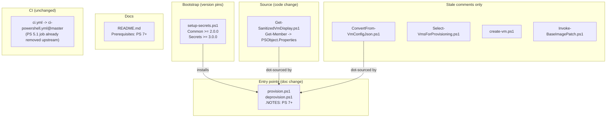

# Problem: Drop PowerShell 5.1 Support

## Index

- [Context](#context)
- [What Is Changing](#what-is-changing)
- [Why Now](#why-now)
- [Affected Components](#affected-components)
- [Out of Scope](#out-of-scope)

---

## Context

This repo is a collection of scripts (no module manifest), so there is no
`PowerShellVersion` field to update. However, PS 5.1 compatibility shaped
several implementation choices that are now stale:

- `provision.ps1` and `deprovision.ps1` declare in their `.NOTES` block:
  `"PowerShell 5.1 (ships with Windows 11) or later. PS 7 is recommended but not required."`
- `setup-secrets.ps1` pins its module dependencies at versions predating the
  PS 7-only releases: `Infrastructure.Common >= 1.3.3` (now `2.0.0`) and
  `Infrastructure.Secrets >= 2.1.0` (now `3.0.0`). Leaving these pins allows
  PSGallery to resolve to the old PS 5.1-era releases, breaking any consumer
  that expects PS 7-only APIs.
- Four source files contain code written specifically to run on PS 5.1, plus
  stale comments documenting that intent in two further files.

CI requires no changes - `ci.yml` delegates to Infrastructure-Common's shared
workflow, which already dropped the PS 5.1 job.

---

## What Is Changing

### Stale entry point documentation

| File | Current state | Target state |
|------|--------------|--------------|
| `hyper-v/ubuntu/provision.ps1` | `.NOTES` states "PowerShell 5.1 ... or later" | States "PowerShell 7+" |
| `hyper-v/ubuntu/deprovision.ps1` | `.NOTES` states "PowerShell 5.1 ... or later" | States "PowerShell 7+" |

### Module version pins (setup-secrets.ps1)

| Dependency | Current pin | Target pin |
|------------|------------|------------|
| `Infrastructure.Common` | `>= 1.3.3` | `>= 2.0.0` (first PS 7-only release) |
| `Infrastructure.Secrets` | `>= 2.1.0` | `>= 3.0.0` (first PS 7-only release) |

### Code compromise

| File | PS 5.1 compromise | Replacement |
|------|-------------------|-------------|
| `hyper-v/ubuntu/common/config/Get-SanitizedVmDisplay.ps1:24` | `Get-Member -InputObject $Vm -MemberType NoteProperty` loop | `$Vm.PSObject.Properties` (idiomatic PS 7) |

### Stale comments only (code stays correct, rationale changes)

| File | Comment to update |
|------|------------------|
| `hyper-v/ubuntu/common/config/ConvertFrom-VmConfigJson.ps1:51-57` | Explains `Get-Member` loop as "PS 5.1 and PS 7" compatible; no longer applies |
| `hyper-v/ubuntu/up/config/Select-VmsForProvisioning.ps1:36-37` | "`Get-VM` throws on a missing name in PS 5.1 without -ErrorAction" - true in PS 7 too, but the PS 5.1 framing is stale |
| `hyper-v/ubuntu/up/config/Select-VmsForProvisioning.ps1:68-71` | `[System.Net.NetworkInformation.Ping]` chosen because `Test-Connection -TimeoutSeconds` was PS 7-only; code stays (preferred for predictability), rationale updated |
| `hyper-v/ubuntu/up/vm/create-vm.ps1:123-125` | `[System.Net.Sockets.TcpClient]` chosen because `Test-NetConnection` output differs between 5.1 and 7; code stays, rationale updated |
| `hyper-v/ubuntu/up/disk/Invoke-BaseImagePatch.ps1:147` | One bullet in the base64 rationale list cites BOM injected by PS 5.1; remove that bullet, other bullets remain valid |

### Docs

| File | Change |
|------|--------|
| `README.md` | Update prerequisites: "PowerShell 5.1+" -> "PowerShell 7+" |

---

## Why Now

- `Infrastructure.Common 2.0.0` and `Infrastructure.Secrets 3.0.0` are now the
  current releases and both require PS 7. Pinning to older versions here risks
  pulling in stale, incompatible releases on a fresh machine.
- The documentation actively misleads operators about the supported runtime.
  All infrastructure scripts already run exclusively on PS 7 in practice.

---

## Affected Components

---

## Out of Scope

- No new tests - all changes are comment/doc/pin updates plus a one-line
  `Get-Member` replacement already covered by `Get-SanitizedVmDisplay`'s
  existing unit tests.
- `[System.Net.NetworkInformation.Ping]` and `[System.Net.Sockets.TcpClient]`
  implementations are unchanged - they remain preferred over their PS cmdlet
  equivalents for predictability; only the PS 5.1 rationale in the comments
  is removed.
- No `ci.yml` changes - the PS 5.1 job removal propagated from Infrastructure-Common.
