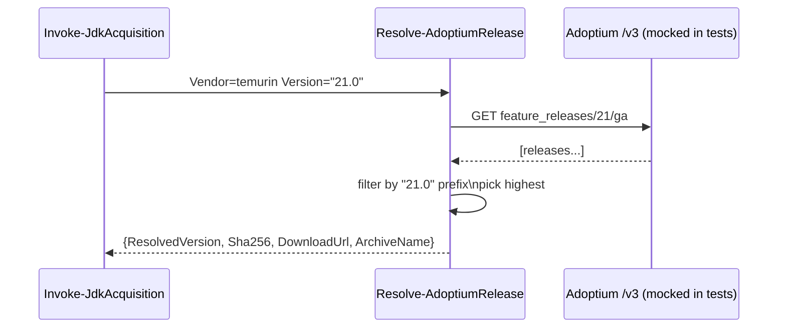
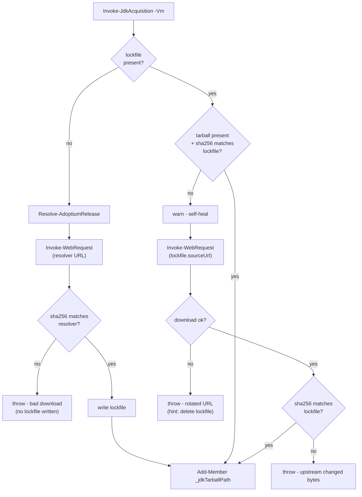
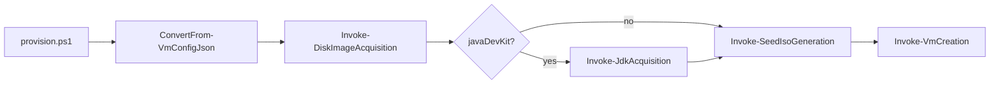
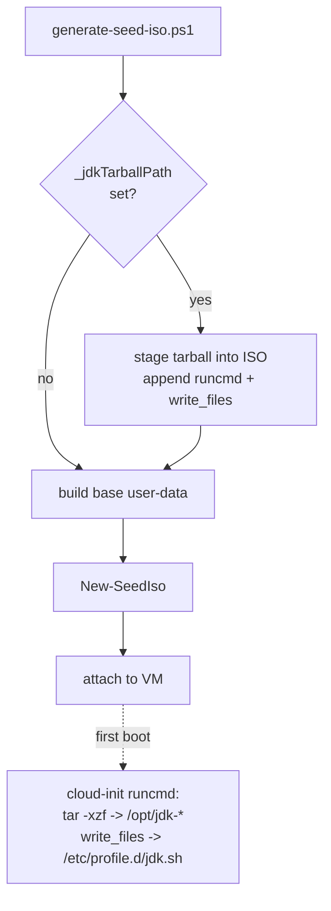
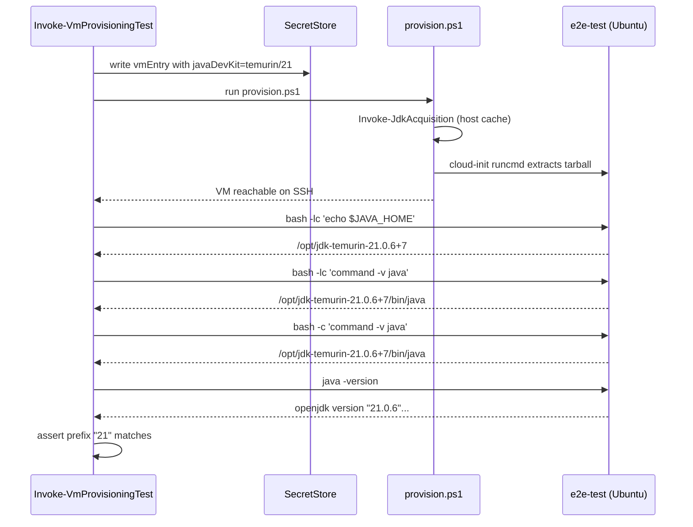

# Plan: Optional Java Development Kit Installation

See [problem.md](problem.md) for context, schema, and rationale.

## Index

- [Decisions Locked](#decisions-locked)
- [Step 1 - Schema validation for `javaDevKit`](#step-1---schema-validation-for-javadevkit)
- [Step 2 - Adoptium version resolver](#step-2---adoptium-version-resolver)
- [Step 3 - Host-side prefetch and cache](#step-3---host-side-prefetch-and-cache)
- [Step 4 - Wire prefetch into `provision.ps1`](#step-4---wire-prefetch-into-provisionps1)
- [Step 5 - Cloud-init delivery and install](#step-5---cloud-init-delivery-and-install)
- [Step 6 - E2E test coverage for the JDK path](#step-6---e2e-test-coverage-for-the-jdk-path)

---

## Decisions Locked

- Lockfile is a host-side cache artifact only. Not committed. Same trust model
  as the cached Ubuntu VHDX.
- `javaDevKit.version` must be a string. Numeric JSON values are rejected by
  the schema check. See the prior conversation for the rationale (trailing-zero
  loss, `21.0.5+11` is not a valid JSON number, single-type schema).

---

## Step 1 - Schema validation for `javaDevKit`

**Reason:** Fail fast on malformed config before any download or VM work. Lays
the schema contract the later steps depend on. Validation lives in its own
function so `ConvertFrom-VmConfigJson` stays a thin orchestrator and the new
rule set is independently testable.

**Files**

- `hyper-v/ubuntu/common/config/Assert-JavaDevKitField.ps1` (new) - dedicated
  validator. Takes the VM object, returns nothing on success, throws on any
  problem. Skips itself when the field is absent.
- `hyper-v/ubuntu/common/config/ConvertFrom-VmConfigJson.ps1` - dot-source
  the new file via the existing dot-source mechanism and add a single
  `Assert-JavaDevKitField -Vm $vm` call inside the per-VM loop, alongside the
  existing `Assert-RequiredProperties` call. No other logic added here.
- `Tests/common/config/Assert-JavaDevKitField.Tests.ps1` (new) - unit tests
  for the validator in isolation.
- `Tests/common/config/ConvertFrom-VmConfigJson.Tests.ps1` - one new case
  asserting `Assert-JavaDevKitField` is invoked for each VM (mocked). All
  granular validation cases live in the dedicated test file above.

**Behaviour (Assert-JavaDevKitField)**

- Input: `$Vm` (the parsed VM definition object).
- Field is optional. When `javaDevKit` is absent, return silently.
- When present, must be an object with required sub-fields `vendor` and
  `version`. Anything else throws.
- `vendor` must equal `temurin` (only supported value in v1).
- `version` must be a string matching one of:
  `^\d+$`, `^\d+\.\d+$`, `^\d+\.\d+\.\d+$`, `^\d+\.\d+\.\d+\+\d+$`.
  Numeric JSON values fail the string-type check before the regex runs and
  yield a message naming the field.
- Extra unknown sub-field on `javaDevKit` throws (strict, to catch silent
  typos like `versoin`).
- No defaulting - if absent it stays absent (downstream code branches on
  presence).

**Tests (unit, mocked) - Assert-JavaDevKitField.Tests.ps1**

- Absent field: returns silently, VM unchanged.
- Present and valid (each of the four version granularities): no throw.
- Vendor missing / unknown: throws with vendor name in message.
- Version missing / wrong type (number) / regex mismatch: throws with field
  name in message.
- Extra unknown sub-field on `javaDevKit`: throws.

**Tests (unit, mocked) - ConvertFrom-VmConfigJson.Tests.ps1**

- One new case: mock `Assert-JavaDevKitField` and assert it is called once
  per VM in the input array. Verifies wiring only - no behaviour duplicated
  from the dedicated test file (memory: don't duplicate called-function
  behaviour in caller's tests).

**README update**

- Add a `javaDevKit` row to the VM JSON schema table with type `object?`
  and a link to the new "Optional: install a JDK" subsection.
- Add the "Optional: install a JDK" subsection (initial draft) listing the
  two sub-fields, allowed vendors, and the four version-string granularities
  with one example. Place it next to other optional-field documentation.

---

## Step 2 - Adoptium version resolver

**Reason:** Translate a user-supplied granularity into a concrete
`{ resolvedVersion, sha256, downloadUrl }`. Isolated as a pure helper so it
can be unit-tested without touching disk or the network in the calling code.

**Files**

- `hyper-v/ubuntu/up/jdk/Resolve-AdoptiumRelease.ps1` (new).
- `Tests/up/jdk/Resolve-AdoptiumRelease.Tests.ps1` (new).

**Behaviour**

- Input: `Vendor` (currently always `temurin`), `Version` (string).
- Queries the Adoptium v3 API:
  - For `^\d+$` (major only): hit
    `/v3/assets/feature_releases/{major}/ga?architecture=x64&image_type=jdk&os=linux&page_size=1&sort_order=DESC`.
  - For `^\d+\.\d+(\.\d+)?(\+\d+)?$`: hit the same endpoint for the major,
    then filter the returned releases client-side to the deepest prefix that
    matches. Pick the highest match.
- Returns a hashtable: `@{ ResolvedVersion = '21.0.5+11'; Sha256 = '...';
  DownloadUrl = '...'; ArchiveName = '...' }`.
- Throws a clear error if zero matches (e.g. `21.99` requested).
- Uses `Invoke-RestMethod` directly - no Adoptium SDK dependency. Wrapping in
  one private helper makes the network call mockable in tests.

**Tests (unit, mocked)**

- Mock the API helper to return a canned payload. Verify:
  - Major-only input returns the highest GA build.
  - Major.minor input filters correctly when API returns mixed lines.
  - Exact `major.minor.patch+build` input returns that exact entry.
  - Zero-match input throws with the requested version in the message.
  - Returned hashtable has all four expected keys.

**Diagram**



**README update**

- In the "Optional: install a JDK" subsection, add a short paragraph
  explaining that version-string granularities resolve against the
  Adoptium v3 API at provision time and that the resolved build is pinned
  in a lockfile (forward-reference to the cache section added in Step 3).

**Reason:** Materialise the tarball on the host with checksum verification
and a sidecar lockfile so re-provisioning is deterministic and offline-safe.

**Files**

- `hyper-v/ubuntu/up/jdk/Invoke-JdkAcquisition.ps1` (new).
- `Tests/up/jdk/Invoke-JdkAcquisition.Tests.ps1` (new).

**Behaviour**

- Input: `$Vm` (must have `javaDevKit` and `vhdPath`).
- Cache key: `jdk-{vendor}-{requestedVersion}-linux-x64` (requested, not
  resolved - two VMs asking for `"21"` share one cache slot until the
  lockfile is removed).
- Flow:
  1. **Lockfile present + tarball matches its sha256:** use the cache. No
     network, no resolver.
  2. **Lockfile present + tarball missing or sha256 mismatch:** self-heal.
     Warn, then redownload from the lockfile's `sourceUrl` and verify
     against the lockfile's `sha256`. The lockfile is the source of truth
     for "what this cache slot committed to" - the resolver is NOT
     re-invoked, so a `"21"` request does not silently upgrade to a newer
     build between runs.
  3. **Lockfile absent (true cache miss):** call `Resolve-AdoptiumRelease`,
     download via `Invoke-WebRequest`, verify sha256 against the resolver's
     value, write the lockfile
     (`{ resolvedVersion, sha256, downloadedUtc, sourceUrl }`).
- **Throw cases** (rare, genuinely abnormal):
  - Self-heal redownload returns 404 / network error: Adoptium has rotated
    away from the pinned URL. Message tells the operator to delete the
    lockfile to force re-resolution.
  - Self-heal redownload completes but the new file's sha256 still does not
    match the lockfile: Adoptium served different bytes for the same URL.
    Message names both hashes.
  - Fresh download (path 3) completes but its sha256 does not match the
    resolver's value: leave no lockfile behind.
- Side-effect: `Add-Member` sets `$Vm._jdkTarballPath` and
  `$Vm._jdkResolvedVersion` for downstream steps. Mirrors the existing
  `_vhdxPath` / `_seedIsoPath` convention.

**Tests (unit, mocked)**

- Mock `Resolve-AdoptiumRelease`, `Invoke-WebRequest`, `Get-FileHash`, and
  filesystem operations. Verify:
  - **Cache hit** (lockfile + tarball with correct hash): resolver NOT
    called, download NOT called, `_jdkTarballPath` set.
  - **Self-heal, tarball missing:** resolver NOT called, download called
    with the lockfile's `sourceUrl`, `_jdkTarballPath` set.
  - **Self-heal, tarball hash mismatch:** resolver NOT called, download
    called with the lockfile's `sourceUrl`, `_jdkTarballPath` set.
  - **Self-heal 404:** throws with a "delete the lockfile" hint.
  - **Self-heal still mismatched after redownload:** throws naming both
    hashes.
  - **True cache miss:** resolver called, download called, lockfile
    written, `_jdkTarballPath` set.
  - **Fresh download hash mismatch:** throws and no lockfile is written.

**Diagram**



**README update**

- Extend the cache-management section to list the new artifacts that
  appear in `vhdPath`: `jdk-{vendor}-{requestedVersion}-linux-x64.tar.gz`
  and the sidecar `*.lock.json`. Note that deleting the lockfile forces
  re-resolution on next provision; deleting only the tarball triggers
  self-heal redownload of the pinned build.

**Reason:** Run the new acquisition between disk acquisition and seed-ISO
generation so the tarball exists before cloud-init is built.

**Files**

- `hyper-v/ubuntu/provision.ps1` - dot-source the new file and add the call
  guarded by `if ($vm.PSObject.Properties['javaDevKit'])`.
- `Tests/Integration/...` - existing integration scaffold gets a new opt-in
  case that asserts a tarball lands in `vhdPath` for a config containing
  `javaDevKit`. No new unit tests at this layer - integration covers it.

**Behaviour**

- Acquisition runs once per VM. Two VMs in the same JSON with the same
  `{vendor, requestedVersion}` resolve to the same cached file on the second
  call via the cache-hit path.
- A VM without `javaDevKit` skips the call entirely - no network, no log
  noise.

**Tests (integration, opt-in)**

- Run `provision.ps1` against a fixture config with `javaDevKit` set.
  Assert tarball + lockfile exist in `vhdPath`. Gated by the existing
  integration opt-in switch so CI does not hit Adoptium.

**Diagram**



**README update**

- Update the provisioning-flow description (where the Ubuntu image
  acquisition step is mentioned) to show the new conditional JDK
  acquisition slot between disk acquisition and seed-ISO generation.

**Reason:** Get the prefetched tarball onto the VM and extracted system-wide
so any user account (including those later created by Infrastructure-Vm-Users)
sees `JAVA_HOME` and `$JAVA_HOME/bin` on `PATH`.

**Files**

- `hyper-v/ubuntu/up/seed/generate-seed-iso.ps1` - when `_jdkTarballPath` is
  set on the VM, copy the tarball into the ISO staging directory and append
  a `runcmd` block + `write_files` entry for `/etc/profile.d/jdk.sh`.
- `hyper-v/ubuntu/up/seed/iso.ps1` - confirm `New-SeedIso` already includes
  arbitrary files in the staging dir; extend only if it filters by name.
- `Tests/up/seed/*.Tests.ps1` - new cases asserting the generated user-data
  contains the install commands when `_jdkTarballPath` is set, and does not
  when it is unset.

**Behaviour**

- Tarball is staged at `/jdk/{archiveName}` on the seed ISO (mounted as
  `/dev/sr0` -> `/var/lib/cloud/seed/nocloud-net/` typically, but the file
  is read directly from the cidata mount).
- `runcmd` (cloud-init):
  - `mkdir -p /opt/jdk-{vendor}-{resolvedVersion}`
  - `tar -xzf /jdk/{archiveName} --strip-components=1 -C /opt/jdk-{vendor}-{resolvedVersion}`
    (Adoptium tarballs have a single top-level dir; `--strip-components=1`
    flattens that into the target.)
  - Guarded by `[ -f /opt/jdk-{vendor}-{resolvedVersion}/release ] || tar ...`
    for idempotency.
- `write_files`: `/etc/profile.d/jdk.sh` with mode `0644`:
  ```sh
  export JAVA_HOME=/opt/jdk-{vendor}-{resolvedVersion}
  export PATH="$JAVA_HOME/bin:$PATH"
  ```

**Tests (unit, mocked)**

- VM without `_jdkTarballPath`: generated user-data has no `runcmd` JDK
  block and no `write_files` for `jdk.sh`.
- VM with `_jdkTarballPath`: generated user-data contains the resolved
  version in the `/opt/jdk-*` path, contains the `--strip-components=1`
  extraction, contains the `write_files` entry, and the idempotency guard
  is present.
- Tarball staging: when `_jdkTarballPath` is set, `New-SeedIso` is called
  with the tarball among its input files.

**Diagram**



**README update**

- In the "Optional: install a JDK" subsection, document the on-VM result:
  install location (`/opt/jdk-{vendor}-{resolvedVersion}/`), the
  `/etc/profile.d/jdk.sh` script, and that any user account (including
  those later created by Infrastructure-Vm-Users) sees `JAVA_HOME` and
  `$JAVA_HOME/bin` on `PATH` automatically.
- Cross-reference Infrastructure-Vm-Users in the relevant section so an
  operator reading either repo's README understands the split of
  responsibilities.

---

## Step 6 - E2E test coverage for the JDK path

**Reason:** The E2E agent already provisions a real VM end-to-end via
[Invoke-VmProvisioningTest.ps1](../../../../../Infrastructure-E2E/agent/e2e/vm-provisioning/Invoke-VmProvisioningTest.ps1).
Extending that test to always exercise the new JDK path catches regressions
that unit tests cannot: an Adoptium API contract change, a botched cloud-init
runcmd, a `$JAVA_HOME` that does not propagate to non-login shells, etc.

Always-on (not gated on operator opt-in) so every E2E run validates the JDK
flow. The cost is one extra Adoptium download per cache miss, which the
host-side cache from Step 3 amortises across runs.

**Files** (live in the Infrastructure-E2E repo, not this one)

- `agent/e2e/vm-provisioning/Invoke-VmProvisioningTest.ps1` -
  - `Invoke-VmProvisioningSetup`: hard-code a `javaDevKit` block into the
    `$vmEntry` written to the vault. Vendor `temurin`, version `"21"`
    (latest GA of feature release 21). Also surface the requested version
    on the returned `vmDef` so the assertion block can read it without
    re-parsing the vault.
  - `Invoke-VmProvisioningTest`: after the existing `hostname` /
    `cloud-init` / `df` assertions, add a JDK assertion block (see
    behaviour below).
- `Tests/Invoke-E2EAgentLoop.Tests.ps1` - if any existing unit-level mock of
  the provisioning setup asserts the shape of the vault entry, extend it to
  expect the new `javaDevKit` field. Otherwise no change.

**Behaviour (JDK assertion block in `Invoke-VmProvisioningTest`)**

Runs over the same `$sshClient` already opened for the existing assertions.
All commands are issued via `Invoke-SshClientCommand`. Each assertion
throws with a clear, actionable message naming the VM and the observed
value on failure.

1. **`JAVA_HOME` is set under a login shell** -
   `bash -lc 'echo $JAVA_HOME'` must exit 0 and produce a non-empty value
   that starts with `/opt/jdk-temurin-`. Confirms `/etc/profile.d/jdk.sh`
   from Step 5 was written and is sourced by login shells.
2. **`java` is on `PATH` for both login and non-login shells** -
   - `bash -lc 'command -v java'` must exit 0 and resolve to a path under
     the `$JAVA_HOME` reported in (1). Confirms login-shell PATH wiring.
   - `bash -c 'command -v java'` must also resolve to a `java` binary
     under the same prefix. Confirms the install is reachable from
     non-login shells too (relevant because services and `ssh user@host
     command` invocations are non-login).
3. **`java -version` succeeds and matches the requested version** -
   `java -version` must exit 0. The combined stdout/stderr output must
   contain the requested version string from the vmEntry's `javaDevKit`
   block (e.g. `"21"`). The match is a prefix check, not exact equality,
   because the resolver legitimately upgrades `"21"` to a concrete build
   like `21.0.6+7` and `java -version` reports the concrete value.

   Requested version is read from `$vmDef.javaDevKit.version` (added by
   the setup function above), not from the lockfile. The lockfile lives
   on the host and is the resolver's pin; the JSON is what the operator
   asked for, which is the contract this E2E should defend.

**Throw cases** (anything unexpected aborts the test - the finally block
still runs teardown):

- `JAVA_HOME` empty or not under `/opt/jdk-temurin-`.
- `command -v java` returns empty, non-zero exit, or a path outside
  `$JAVA_HOME/bin`.
- `java -version` exits non-zero, or its output does not contain the
  requested version prefix.

**Tests (no new Pester tests)**

E2E is the test layer. The mock-level unit test in
`Tests/Invoke-E2EAgentLoop.Tests.ps1` already covers the agent loop
plumbing; no behavioural duplication of the new assertions there.

**Diagram**



**README update** (Infrastructure-E2E, not this repo)

- In the E2E README's test description, note that the VM provisioning E2E
  also asserts the JDK install path: `JAVA_HOME` shape, `java` on `PATH`
  in both login and non-login shells, and `java -version` matching the
  requested version. Mention that the requested version is hard-coded to
  `temurin/21` so the assertion is stable across operator workstations.
