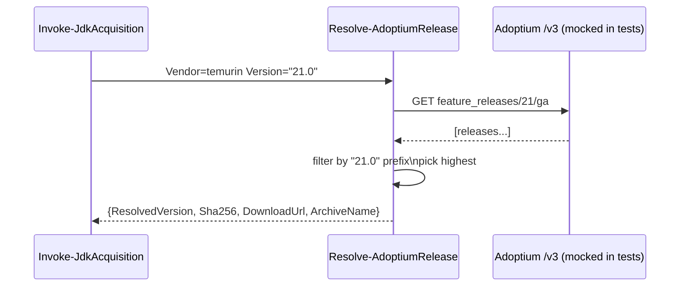
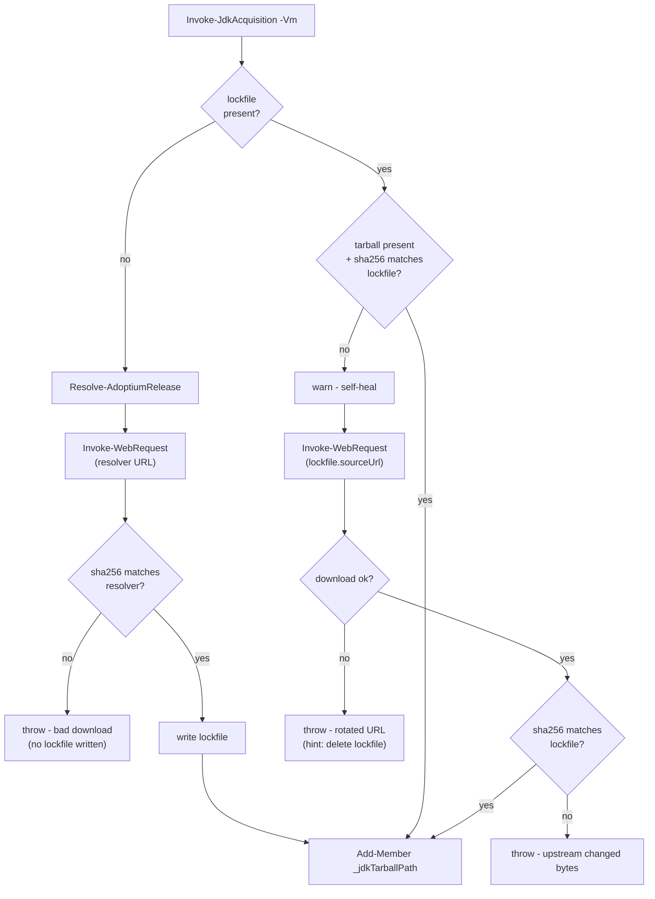
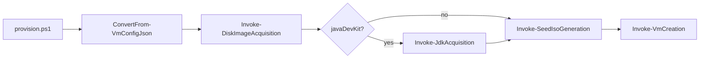
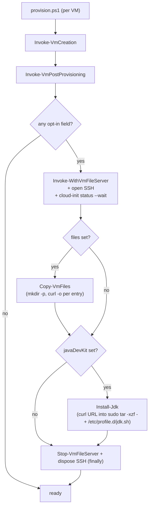
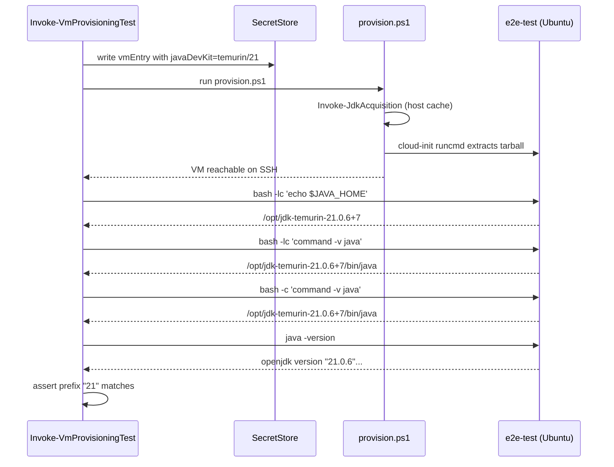

# Plan: Optional Java Development Kit Installation

See [problem.md](problem.md) for context, schema, and rationale.

## Index

- [Step 1 - Schema validation for `javaDevKit`](#step-1---schema-validation-for-javadevkit)
- [Step 2 - Adoptium version resolver](#step-2---adoptium-version-resolver)
- [Step 3 - Host-side prefetch and cache](#step-3---host-side-prefetch-and-cache)
- [Step 4 - Wire prefetch into `provision.ps1`](#step-4---wire-prefetch-into-provisionps1)
- [Step 5 - Out-of-band post-provisioning pipeline](#step-5---out-of-band-post-provisioning-pipeline)
- [Step 6 - E2E test coverage for the JDK path](#step-6---e2e-test-coverage-for-the-jdk-path)

---

## Step 1 - Schema validation for `javaDevKit`

**Reason:** Fail fast on malformed config before any download or VM work. Lays
the schema contract the later steps depend on. Validation lives in its own
function so `ConvertFrom-VmConfigJson` stays a thin orchestrator and the new
rule set is independently testable.

**Decisions locked**

- `javaDevKit.version` must be a **string**. Numeric JSON values are
  rejected by the schema check. Reason: trailing-zero loss (`"21.0"`
  cannot survive as distinct from `21` once parsed as a number) and
  `21.0.5+11` is not a valid JSON number at all - "string only" is the
  single consistent rule.

**Files**

- `hyper-v/ubuntu/common/config/Assert-JavaDevKitField.ps1` (new) - dedicated
  validator. Takes the VM object, returns nothing on success, throws on any
  problem. Skips itself when the field is absent.
- `hyper-v/ubuntu/common/config/ConvertFrom-VmConfigJson.ps1` - dot-source
  the new file via the existing dot-source mechanism and add a single
  `Assert-JavaDevKitField -Vm $vm` call inside the per-VM loop, alongside the
  existing `Assert-RequiredProperties` call. No other logic added here.
- `Tests/common/config/Assert-JavaDevKitField.Tests.ps1` (new) - unit tests
  for the validator in isolation.
- `Tests/common/config/ConvertFrom-VmConfigJson.Tests.ps1` - one new case
  asserting `Assert-JavaDevKitField` is invoked for each VM (mocked). All
  granular validation cases live in the dedicated test file above.

**Behaviour (Assert-JavaDevKitField)**

- Input: `$Vm` (the parsed VM definition object).
- Field is optional. When `javaDevKit` is absent, return silently.
- When present, must be an object with required sub-fields `vendor` and
  `version`. Anything else throws.
- `vendor` must equal `temurin` (only supported value in v1).
- `version` must be a string matching one of:
  `^\d+$`, `^\d+\.\d+$`, `^\d+\.\d+\.\d+$`, `^\d+\.\d+\.\d+\+\d+$`.
  Numeric JSON values fail the string-type check before the regex runs and
  yield a message naming the field.
- Extra unknown sub-field on `javaDevKit` throws (strict, to catch silent
  typos like `versoin`).
- No defaulting - if absent it stays absent (downstream code branches on
  presence).

**Tests (unit, mocked) - Assert-JavaDevKitField.Tests.ps1**

- Absent field: returns silently, VM unchanged.
- Present and valid (each of the four version granularities): no throw.
- Vendor missing / unknown: throws with vendor name in message.
- Version missing / wrong type (number) / regex mismatch: throws with field
  name in message.
- Extra unknown sub-field on `javaDevKit`: throws.

**Tests (unit, mocked) - ConvertFrom-VmConfigJson.Tests.ps1**

- One new case: mock `Assert-JavaDevKitField` and assert it is called once
  per VM in the input array. Verifies wiring only - no behaviour duplicated
  from the dedicated test file (memory: don't duplicate called-function
  behaviour in caller's tests).

**README update**

- Add a `javaDevKit` row to the VM JSON schema table with type `object?`
  and a link to the new "Optional: install a JDK" subsection.
- Add the "Optional: install a JDK" subsection (initial draft) listing the
  two sub-fields, allowed vendors, and the four version-string granularities
  with one example. Place it next to other optional-field documentation.

---

## Step 2 - Adoptium version resolver

**Reason:** Translate a user-supplied granularity into a concrete
`{ resolvedVersion, sha256, downloadUrl }`. Isolated as a pure helper so it
can be unit-tested without touching disk or the network in the calling code.

**Files**

- `hyper-v/ubuntu/up/jdk/Resolve-AdoptiumRelease.ps1` (new).
- `Tests/up/jdk/Resolve-AdoptiumRelease.Tests.ps1` (new).

**Behaviour**

- Input: `Vendor` (currently always `temurin`), `Version` (string).
- Queries the Adoptium v3 API:
  - For `^\d+$` (major only): hit
    `/v3/assets/feature_releases/{major}/ga?architecture=x64&image_type=jdk&os=linux&page_size=1&sort_order=DESC`.
  - For `^\d+\.\d+(\.\d+)?(\+\d+)?$`: hit the same endpoint for the major,
    then filter the returned releases client-side to the deepest prefix that
    matches. Pick the highest match.
- Returns a hashtable: `@{ ResolvedVersion = '21.0.5+11'; Sha256 = '...';
  DownloadUrl = '...'; ArchiveName = '...' }`.
- Throws a clear error if zero matches (e.g. `21.99` requested).
- Uses `Invoke-RestMethod` directly - no Adoptium SDK dependency. Wrapping in
  one private helper makes the network call mockable in tests.

**Tests (unit, mocked)**

- Mock the API helper to return a canned payload. Verify:
  - Major-only input returns the highest GA build.
  - Major.minor input filters correctly when API returns mixed lines.
  - Exact `major.minor.patch+build` input returns that exact entry.
  - Zero-match input throws with the requested version in the message.
  - Returned hashtable has all four expected keys.

**Diagram**



**README update**

- In the "Optional: install a JDK" subsection, add a short paragraph
  explaining that version-string granularities resolve against the
  Adoptium v3 API at provision time and that the resolved build is pinned
  in a lockfile (forward-reference to the cache section added in Step 3).

**Reason:** Materialise the tarball on the host with checksum verification
and a sidecar lockfile so re-provisioning is deterministic and offline-safe.

**Decisions locked**

- The lockfile is a **host-side cache artifact only**. Not committed.
  Same trust model as the cached Ubuntu VHDX.

**Files**

- `hyper-v/ubuntu/up/jdk/Invoke-JdkAcquisition.ps1` (new).
- `Tests/up/jdk/Invoke-JdkAcquisition.Tests.ps1` (new).

**Behaviour**

- Input: `$Vm` (must have `javaDevKit` and `vhdPath`).
- Cache key: `jdk-{vendor}-{requestedVersion}-linux-x64` (requested, not
  resolved - two VMs asking for `"21"` share one cache slot until the
  lockfile is removed).
- Flow:
  1. **Lockfile present + tarball matches its sha256:** use the cache. No
     network, no resolver.
  2. **Lockfile present + tarball missing or sha256 mismatch:** self-heal.
     Warn, then redownload from the lockfile's `sourceUrl` and verify
     against the lockfile's `sha256`. The lockfile is the source of truth
     for "what this cache slot committed to" - the resolver is NOT
     re-invoked, so a `"21"` request does not silently upgrade to a newer
     build between runs.
  3. **Lockfile absent (true cache miss):** call `Resolve-AdoptiumRelease`,
     download via `Invoke-WebRequest`, verify sha256 against the resolver's
     value, write the lockfile
     (`{ resolvedVersion, sha256, downloadedUtc, sourceUrl }`).
- **Throw cases** (rare, genuinely abnormal):
  - Self-heal redownload returns 404 / network error: Adoptium has rotated
    away from the pinned URL. Message tells the operator to delete the
    lockfile to force re-resolution.
  - Self-heal redownload completes but the new file's sha256 still does not
    match the lockfile: Adoptium served different bytes for the same URL.
    Message names both hashes.
  - Fresh download (path 3) completes but its sha256 does not match the
    resolver's value: leave no lockfile behind.
- Side-effect: `Add-Member` sets `$Vm._jdkTarballPath` and
  `$Vm._jdkResolvedVersion` for downstream steps. Mirrors the existing
  `_vhdxPath` / `_seedIsoPath` convention.

**Tests (unit, mocked)**

- Mock `Resolve-AdoptiumRelease`, `Invoke-WebRequest`, `Get-FileHash`, and
  filesystem operations. Verify:
  - **Cache hit** (lockfile + tarball with correct hash): resolver NOT
    called, download NOT called, `_jdkTarballPath` set.
  - **Self-heal, tarball missing:** resolver NOT called, download called
    with the lockfile's `sourceUrl`, `_jdkTarballPath` set.
  - **Self-heal, tarball hash mismatch:** resolver NOT called, download
    called with the lockfile's `sourceUrl`, `_jdkTarballPath` set.
  - **Self-heal 404:** throws with a "delete the lockfile" hint.
  - **Self-heal still mismatched after redownload:** throws naming both
    hashes.
  - **True cache miss:** resolver called, download called, lockfile
    written, `_jdkTarballPath` set.
  - **Fresh download hash mismatch:** throws and no lockfile is written.

**Diagram**



**README update**

- Extend the cache-management section to list the new artifacts that
  appear in `vhdPath`: `jdk-{vendor}-{requestedVersion}-linux-x64.tar.gz`
  and the sidecar `*.lock.json`. Note that deleting the lockfile forces
  re-resolution on next provision; deleting only the tarball triggers
  self-heal redownload of the pinned build.

**Reason:** Run the new acquisition between disk acquisition and seed-ISO
generation so the tarball exists before cloud-init is built.

**Files**

- `hyper-v/ubuntu/provision.ps1` - dot-source the new file and add the call
  guarded by `if ($vm.PSObject.Properties['javaDevKit'])`.
- `Tests/Integration/...` - existing integration scaffold gets a new opt-in
  case that asserts a tarball lands in `vhdPath` for a config containing
  `javaDevKit`. No new unit tests at this layer - integration covers it.

**Behaviour**

- Acquisition runs once per VM. Two VMs in the same JSON with the same
  `{vendor, requestedVersion}` resolve to the same cached file on the second
  call via the cache-hit path.
- A VM without `javaDevKit` skips the call entirely - no network, no log
  noise.

**Tests (integration, opt-in)**

- Run `provision.ps1` against a fixture config with `javaDevKit` set.
  Assert tarball + lockfile exist in `vhdPath`. Gated by the existing
  integration opt-in switch so CI does not hit Adoptium.

**Diagram**



**README update**

- Update the provisioning-flow description (where the Ubuntu image
  acquisition step is mentioned) to show the new conditional JDK
  acquisition slot between disk acquisition and seed-ISO generation.

## Step 5 - Out-of-band post-provisioning pipeline

**Reason:** Get the prefetched JDK tarball onto the VM (and any other
user-declared files) without putting cloud-init in charge of the install.
cloud-init's job is to stand up the OS; the provisioner installs optional
software. Same separation already used by `register-runners.ps1`
(GitHubRunners repo) and `reconcile-users.ps1` (Vm-Users repo).

**Decisions locked**

- JDK is installed **out-of-band, after cloud-init finishes**, not via
  cloud-init `runcmd` reading from the seed ISO. The cidata ISO is a
  cloud-init metadata channel, not a file-delivery channel; routing the
  tarball through it would force the seed-ISO lifecycle to span the
  entire cloud-init run, widen the plaintext-password exposure window,
  and put cloud-init stage knowledge into the host provisioner. The
  chosen mechanism mirrors the existing `register-runners.ps1` pattern:
  `Invoke-WithVmFileServer` / `Add-VmFileServerFile` plus SSH from the
  host.
- Post-provisioning is structured as **one orchestrator + N
  self-contained step functions**, not one self-contained per-software
  function. The transport (host file server + SSH session + cloud-init
  wait) is a per-VM concern that should be paid once, not per step.
  With two known callers in flight (JDK install, generic file copy)
  the right shape is visible. Each step receives a live `$SshClient` +
  `$Server` from the orchestrator; steps are forbidden from depending
  on each other's outputs so dispatch order is not load-bearing and
  any step can be re-run in isolation.
- The optional `files` array is **purely user data** - no install step
  reads from the paths it writes. Each install owns its own
  acquisition + transfer + extraction. This keeps install descriptors
  (`javaDevKit`, future `maven`, ...) orthogonal: none reaches into
  another's space, and the `files` shape never has to grow
  install-aware semantics.
- `Copy-VmFiles` (the transport) and `Assert-VmFilesField` (the shared
  schema validator) live in **Infrastructure.HyperV**, not in this
  repo. `Infrastructure-Vm-Users` will need the same primitives for
  its own (user-owned) file copies, and duplicating them across repos
  would drift over time. Each consumer extends the shared validator
  via `-AllowedSubFields` / `-PostEntryValidator`; the consumer's
  wrapper is ~5 lines of policy on top of ~50 lines of shared shape
  checks.
- The provisioner's `files` policy is **root-owned, world-readable**
  (`root:root, 0644`). The provisioner runs *before*
  Infrastructure-Vm-Users creates app users, so no per-user owner
  exists to chown to. Files that need per-user ownership belong in
  Vm-Users' `files` (a future addition). The provisioner's schema
  therefore rejects `owner` / `mode` sub-fields by way of
  `Assert-VmFilesField`'s default allow-list - no
  `PostEntryValidator` is supplied here.
- The JDK tarball deliberately does NOT route through the generic
  `files` flow. (a) The tarball is transient (extract-then-discard)
  while user `files` are persistent at user-declared paths - mixing
  them would force a "delete after use" semantic into the descriptor.
  (b) The JDK install streams `curl | tar` so the tarball never
  lands on the VM disk; routing through `files` would give that up
  for symmetry alone.

The shape is **one orchestrator + N self-contained step functions**, not a
single per-software function. Reasons:

- The transport (host file server + SSH session + cloud-init wait) is a
  per-VM concern that should be paid once, not per step.
- A second use case (copying user-declared JARs onto the VM via a `files`
  array) is already known. With two callers, the right shape is visible:
  share transport, keep step logic local.
- Each step is **self-contained** - it must NOT consume files left on the
  VM by another step. If a future install needs an artefact, it acquires
  and ships its own copy. This keeps steps independently re-runnable and
  dispatch order non-load-bearing.

**Files**

- `hyper-v/ubuntu/up/post/Invoke-VmPostProvisioning.ps1` (new) - per-VM
  orchestrator. Opens the file server with `Invoke-WithVmFileServer`,
  opens one SSH client, waits once for cloud-init, dispatches each
  enabled step. Exits silently when no opt-in fields are set.
- `hyper-v/ubuntu/up/post/Install-Jdk.ps1` (new) - JDK install step.
  Receives a live `$SshClient` and `$Server` from the orchestrator,
  stages the prefetched tarball via `Add-VmFileServerFile`, and runs
  `curl URL | sudo tar -xzf - --strip-components=1 -C /opt/jdk-*` plus
  the `/etc/profile.d/jdk.sh` write. Streaming pattern - no intermediate
  file on the VM disk.
- `hyper-v/ubuntu/common/config/ConvertFrom-VmConfigJson.ps1` - call
  `Assert-VmFilesField -Vm $vm` (no extra arguments) alongside
  `Assert-JavaDevKitField`. `Assert-VmFilesField` is supplied by
  Infrastructure.HyperV; the provisioner's default policy of
  "source + target only" is the cmdlet's default allow-list.
- `Copy-VmFiles` / `Assert-VmFilesField` themselves live in
  Infrastructure.HyperV (v0.3.0+). See that repo for the cmdlet source
  and unit tests; this repo only invokes them.
- `hyper-v/ubuntu/provision.ps1` - dot-source the three new files; in
  the post-provisioning loop, call `Invoke-VmPostProvisioning -Vm $vm`
  unconditionally for every VM (the orchestrator self-skips).
- `Tests/up/post/Invoke-VmPostProvisioning.Tests.ps1` (new) - wiring
  tests for the orchestrator (transport + cloud-init wait + dispatch).
  Asserts the orchestrator builds `-Entries` from `$Vm.files` before
  calling `Copy-VmFiles`.
- `Tests/up/post/Install-Jdk.Tests.ps1` (new) - JDK-specific shell shape
  only; transport is mocked.
- Tests for `Copy-VmFiles` and `Assert-VmFilesField` live with their
  source in Infrastructure.HyperV's `Tests/` directory.

**Behaviour - `Invoke-VmPostProvisioning -Vm`**

1. Returns silently if neither `$Vm.javaDevKit` nor a non-empty
   `$Vm.files` is set.
2. `Invoke-WithVmFileServer -VmIpAddress $Vm.ipAddress -ScriptBlock { ... }`
   so the listener + firewall rule + staging dir are cleaned up in a
   `finally` regardless of failure.
3. Inside the scriptblock (closure-bound via `.GetNewClosure()` so
   function locals are visible when invoked from the
   Infrastructure.HyperV module):
   - Open one SSH client as `$Vm.username` / `$Vm.password`.
   - `timeout 600 cloud-init status --wait` once. Non-zero is logged via
     `Write-Warning` but not fatal - downstream assertions catch real
     problems and a non-zero status is most often unrelated to our steps.
   - Dispatch (stylistic order): `Copy-VmFiles` if `$Vm.files` set, then
     `Install-Jdk` if `$Vm.javaDevKit` set.
   - Disconnect + dispose the SSH client in a step-local `finally`.

**Behaviour - `Install-Jdk -SshClient -Server -Vm`**

- Stages `$Vm._jdkTarballPath` via `Add-VmFileServerFile`.
- One SSH round-trip under `set -e`, guarded by
  `[ -f /opt/jdk-{vendor}-{resolvedVersion}/release ]` for idempotency:
  ```sh
  curl -fsSL "$url" | sudo tar -xzf - --strip-components=1 -C "$install_dir"
  printf 'export JAVA_HOME=%s\nexport PATH="$JAVA_HOME/bin:$PATH"\n' \
    "$install_dir" | sudo tee /etc/profile.d/jdk.sh > /dev/null
  ```
- Throws with `$Vm.vmName` named in the message on non-zero exit.

**Behaviour - `Copy-VmFiles -SshClient -Server -Vm`**

- For each `{ source, target }` in `$Vm.files`:
  - Stage via `Add-VmFileServerFile -LocalPath $source` -> URL.
  - One SSH round-trip: `mkdir -p $(dirname target)` + `curl -fsSL -o
    target url`.
- Throws with both `source` and `target` named in the message on non-zero
  exit so the operator can identify the offending entry.
- Idempotency: `curl -o` overwrites. The user's intent is "this file
  should look like this".

**Tests (unit, mocked)**

- `Invoke-VmPostProvisioning.Tests.ps1`:
  - No-op when both fields absent (and when `files` is `[]`).
  - File server opened with the VM IP; SSH connected as the admin user.
  - cloud-init wait issued exactly once and capped with `timeout(1)`.
  - Dispatch fires only for the steps whose field is present.
  - When both fields are set, `Copy-VmFiles` runs before `Install-Jdk`.
  - Non-zero cloud-init exit does not block dispatch.
- `Install-Jdk.Tests.ps1`:
  - Stages the prefetched tarball via the file server.
  - Issued command extracts under `/opt/jdk-{vendor}-{resolvedVersion}`
    with `--strip-components=1`, has the release-file idempotency guard,
    writes `/etc/profile.d/jdk.sh`, references the staged URL, and uses
    the `curl | sudo tar -xzf -` streaming pattern.
  - Does NOT issue any `cloud-init` command itself (orchestrator's job).
  - Throws on non-zero install exit, naming the VM.
- `Copy-VmFiles.Tests.ps1`:
  - Each entry stages once and issues one SSH command.
  - Parent dir is created before the curl download.
  - Issued command references both the staged URL and the declared
    target.
  - Throws on non-zero exit, naming both source and target.
- `Assert-FilesField.Tests.ps1`:
  - Absent / empty array returns silently.
  - Valid single / multiple entries with existing source paths.
  - Rejects: bare object, string, array of non-objects, unknown
    sub-fields, missing source/target, empty source/target,
    non-existent source path, relative target, Windows-style target.

**Diagram**



**README updates**

- New subsection "Optional: copy files to the VM" documenting the `files`
  schema and contract (purely user data; not consumed by any install).
- "Optional: install a JDK" subsection: clarify that the install runs
  inside the post-provisioning orchestrator over an already-open SSH
  session, and uses the streaming `curl | tar` pattern (no intermediate
  file on the VM disk).
- Provisioning-flow numbered list: step 10 describes the post-provisioning
  orchestrator and lists each dispatched step.
- File tree: add `up/post/` directory with the three new files; add
  `Assert-FilesField.ps1` under `common/config/`.
- Schema table: add `files` row of type `array?`.
- Cross-reference Infrastructure-Vm-Users in the relevant section so an
  operator reading either repo's README understands the split of
  responsibilities.

---

## Step 6 - E2E test coverage for the JDK path

**Reason:** The E2E agent already provisions a real VM end-to-end via
[Invoke-VmProvisioningTest.ps1](../../../../../Infrastructure-E2E/agent/e2e/vm-provisioning/Invoke-VmProvisioningTest.ps1).
Extending that test to always exercise the new JDK path catches regressions
that unit tests cannot: an Adoptium API contract change, a botched cloud-init
runcmd, a `$JAVA_HOME` that does not propagate to non-login shells, etc.

Always-on (not gated on operator opt-in) so every E2E run validates the JDK
flow. The cost is one extra Adoptium download per cache miss, which the
host-side cache from Step 3 amortises across runs.

**Files** (live in the Infrastructure-E2E repo, not this one)

- `agent/e2e/vm-provisioning/Invoke-VmProvisioningTest.ps1` -
  - `Invoke-VmProvisioningSetup`: hard-code a `javaDevKit` block into the
    `$vmEntry` written to the vault. Vendor `temurin`, version `"21"`
    (latest GA of feature release 21). Also surface the requested version
    on the returned `vmDef` so the assertion block can read it without
    re-parsing the vault.
  - `Invoke-VmProvisioningTest`: after the existing `hostname` /
    `cloud-init` / `df` assertions, add a JDK assertion block (see
    behaviour below).
- `Tests/Invoke-E2EAgentLoop.Tests.ps1` - if any existing unit-level mock of
  the provisioning setup asserts the shape of the vault entry, extend it to
  expect the new `javaDevKit` field. Otherwise no change.

**Behaviour (JDK assertion block in `Invoke-VmProvisioningTest`)**

Runs over the same `$sshClient` already opened for the existing assertions.
All commands are issued via `Invoke-SshClientCommand`. Each assertion
throws with a clear, actionable message naming the VM and the observed
value on failure.

1. **`JAVA_HOME` is set under a login shell** -
   `bash -lc 'echo $JAVA_HOME'` must exit 0 and produce a non-empty value
   that starts with `/opt/jdk-temurin-`. Confirms `/etc/profile.d/jdk.sh`
   from Step 5 was written and is sourced by login shells.
2. **`java` is on `PATH` for both login and non-login shells** -
   - `bash -lc 'command -v java'` must exit 0 and resolve to a path under
     the `$JAVA_HOME` reported in (1). Confirms login-shell PATH wiring.
   - `bash -c 'command -v java'` must also resolve to a `java` binary
     under the same prefix. Confirms the install is reachable from
     non-login shells too (relevant because services and `ssh user@host
     command` invocations are non-login).
3. **`java -version` succeeds and matches the requested version** -
   `java -version` must exit 0. The combined stdout/stderr output must
   contain the requested version string from the vmEntry's `javaDevKit`
   block (e.g. `"21"`). The match is a prefix check, not exact equality,
   because the resolver legitimately upgrades `"21"` to a concrete build
   like `21.0.6+7` and `java -version` reports the concrete value.

   Requested version is read from `$vmDef.javaDevKit.version` (added by
   the setup function above), not from the lockfile. The lockfile lives
   on the host and is the resolver's pin; the JSON is what the operator
   asked for, which is the contract this E2E should defend.

**Throw cases** (anything unexpected aborts the test - the finally block
still runs teardown):

- `JAVA_HOME` empty or not under `/opt/jdk-temurin-`.
- `command -v java` returns empty, non-zero exit, or a path outside
  `$JAVA_HOME/bin`.
- `java -version` exits non-zero, or its output does not contain the
  requested version prefix.

**Tests (no new Pester tests)**

E2E is the test layer. The mock-level unit test in
`Tests/Invoke-E2EAgentLoop.Tests.ps1` already covers the agent loop
plumbing; no behavioural duplication of the new assertions there.

**Diagram**



**README update** (Infrastructure-E2E, not this repo)

- In the E2E README's test description, note that the VM provisioning E2E
  also asserts the JDK install path: `JAVA_HOME` shape, `java` on `PATH`
  in both login and non-login shells, and `java -version` matching the
  requested version. Mention that the requested version is hard-coded to
  `temurin/21` so the assertion is stable across operator workstations.
