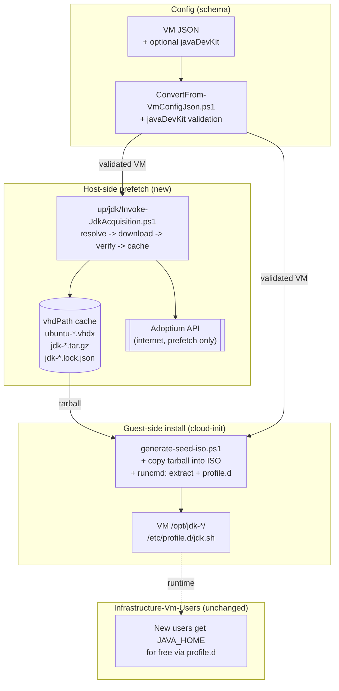
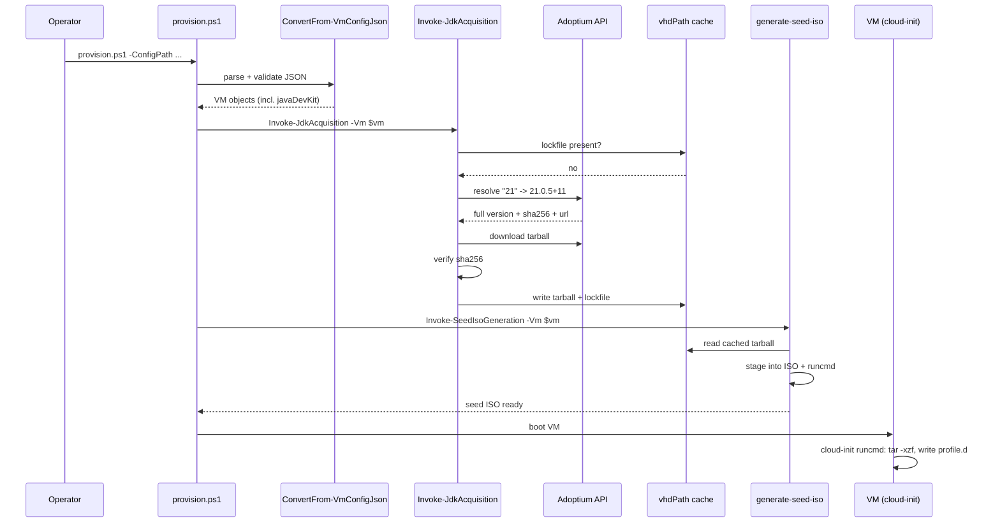

# Problem: Optional Java Development Kit Installation

## Index

- [Context](#context)
- [What Is Changing](#what-is-changing)
  - [New optional JSON field: `javaDevKit`](#new-optional-json-field-javadevkit)
  - [Version-string granularity](#version-string-granularity)
  - [Host-side prefetch and cache](#host-side-prefetch-and-cache)
  - [Guest-side system-wide install](#guest-side-system-wide-install)
- [Why Now](#why-now)
- [Affected Components](#affected-components)
- [Out of Scope](#out-of-scope)
- [Open Questions](#open-questions)

---

## Context

`provision.ps1` accepts a JSON array of VM definitions (see
`hyper-v/ubuntu/common/config/ConvertFrom-VmConfigJson.ps1`). The required
schema is fixed; optional fields default in `ConvertFrom-VmConfigJson` (e.g.
`switchName`, `natName`). Today there is no way to declare software that
should be installed in the guest beyond what cloud-init defaults to.

A pre-fetch pattern already exists for the Ubuntu cloud image
(`up/disk/Invoke-DiskImageAcquisition.ps1`): download an archive into the
shared `vhdPath` cache directory, extract, and reuse on subsequent runs. The
new JDK feature follows the same shape.

Cloud-init `user-data` is generated per-VM in
`up/seed/generate-seed-iso.ps1` and delivered via the NoCloud seed ISO. This
is the natural place to add install commands once the tarball is staged.

---

## What Is Changing

### New optional JSON field: `javaDevKit`

A VM definition gains one optional object field. When absent, behaviour is
unchanged. When present, the provisioner installs the requested JDK.

```json
{
  "vmName": "dev-01",
  "...": "...",
  "javaDevKit": {
    "vendor":  "temurin",
    "version": "21"
  }
}
```

| Sub-field | Allowed values (initial scope) | Notes |
|-----------|--------------------------------|-------|
| `vendor`  | `temurin`                      | Adoptium Temurin only in v1. Schema is extensible; future vendors (e.g. `corretto`, `zulu`) added behind the same field. |
| `version` | See [granularity table](#version-string-granularity) | Must be a string. Numeric `21` is rejected to avoid YAML/JSON quirks turning `21.0` into `21`. |

Validation lives in `ConvertFrom-VmConfigJson` so a malformed field fails
before any download or VM work begins.

### Version-string granularity

| User writes | Meaning | Resolution behaviour |
|-------------|---------|----------------------|
| `"21"` | Latest GA of feature release 21 | Adoptium API query for newest 21.x.y |
| `"21.0"` | Latest GA on 21.0 line | Adoptium API query, filtered to `21.0.*` |
| `"21.0.5"` | Latest build of 21.0.5 | Adoptium API query, filtered to `21.0.5+*` |
| `"21.0.5+11"` | Exact build | No resolution, fetched directly |

Resolution happens **at prefetch time** (host has internet). The resolved
full version is recorded in a sidecar lockfile next to the cached tarball so
that a re-provision without internet uses the same artifact, and so that two
VMs requesting `"21"` on the same day get the same build.

### Host-side prefetch and cache

| Aspect | Decision |
|--------|----------|
| Cache directory | Same `vhdPath` dir already used by `Invoke-DiskImageAcquisition`. JDK tarballs sit alongside Ubuntu VHDXs. |
| File naming | `jdk-{vendor}-{resolvedVersion}-linux-x64.tar.gz` |
| Lockfile | `jdk-{vendor}-{requestedVersion}-linux-x64.lock.json`, content: `{ resolvedVersion, sha256, downloadedUtc }` |
| Checksum | SHA-256 published by Adoptium is verified after download and recorded in the lockfile. Tarball is re-downloaded if the file is present but the hash does not match. |
| Architecture | `linux-x64` hardcoded in v1 (matches the existing amd64 Ubuntu base image). |
| Reuse across VMs | Two VMs requesting the same `{vendor, requestedVersion}` share one cached tarball and one lockfile. |

New module: `up/jdk/Invoke-JdkAcquisition.ps1`, dot-sourced by `provision.ps1`
in the same place `Invoke-DiskImageAcquisition` is invoked.

### Guest-side system-wide install

The install is system-wide so the JDK is visible to every user later created
by Infrastructure-Vm-Users without that repo needing to know about JDKs.

| Layer | Behaviour |
|-------|-----------|
| Delivery | Tarball is included on the NoCloud seed ISO under `/jdk/`. `generate-seed-iso.ps1` copies the cached tarball into the ISO staging directory when `javaDevKit` is set. |
| Extraction target | `/opt/jdk-{vendor}-{resolvedVersion}/` |
| `JAVA_HOME` / `PATH` | A new `/etc/profile.d/jdk.sh` exports `JAVA_HOME` and prepends `$JAVA_HOME/bin` to `PATH`. Loaded automatically by every login shell. |
| Trigger | A `runcmd` block added to the cloud-init `user-data` extracts the tarball and writes `jdk.sh` on first boot. |
| Idempotency | `runcmd` skips extraction if `/opt/jdk-{vendor}-{resolvedVersion}/release` already exists, so re-running cloud-init is safe. |

---

## Why Now

- Several upcoming workloads need a JDK on the VM and currently require a
  manual step after provisioning, breaking the "one JSON file in,
  reproducible VM out" guarantee of this repo.
- The Ubuntu image prefetch pattern is mature and well-tested, so adding a
  second prefetched artifact is low-risk and reuses an existing cache
  directory.
- Doing the install at provision time (rather than later in
  Infrastructure-Vm-Users) keeps the responsibility split clean: provisioner
  owns "software the box needs"; Vm-Users owns identities.

---

## Affected Components



Sequence on a fresh host (cache miss):



---

## Out of Scope

- Vendors other than Temurin (`corretto`, `zulu`, Oracle JDK, GraalVM).
  Schema is shaped for them; implementation is single-vendor.
- Architectures other than `linux-x64`. ARM/aarch64 VMs are not currently
  produced by this repo.
- JRE-only installs. Field is named `javaDevKit` deliberately.
- Multiple coexisting JDKs on one VM (`update-alternatives` orchestration).
  One JDK per VM in v1.
- Automatic JDK upgrades after provisioning. The cached resolved version is
  pinned via the lockfile; bumping requires editing the JSON.
- Removal/uninstall path on `deprovision.ps1` - the per-VM disk is destroyed
  with the VM, so nothing extra is needed.

---

## Open Questions

1. Should the lockfile be committed somewhere (config repo) or treated as a
   pure host-side cache artifact? Current proposal: host-side only; same
   trust model as the Ubuntu cache.
2. Should `javaDevKit.version` accept a leading `"jdk-"` prefix as a
   convenience (matching Adoptium tag naming)? Current proposal: no, keep
   it strictly numeric to avoid two formats for the same thing.
