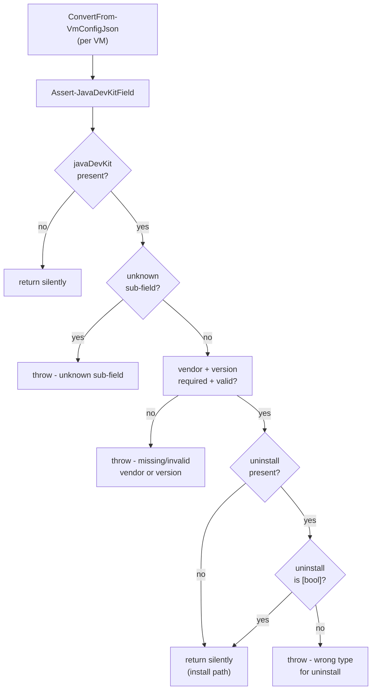
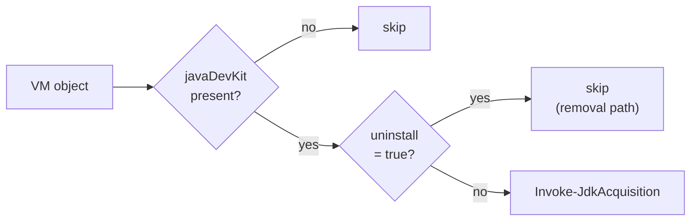
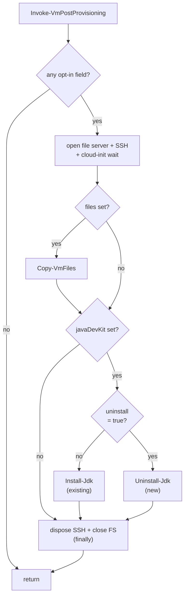
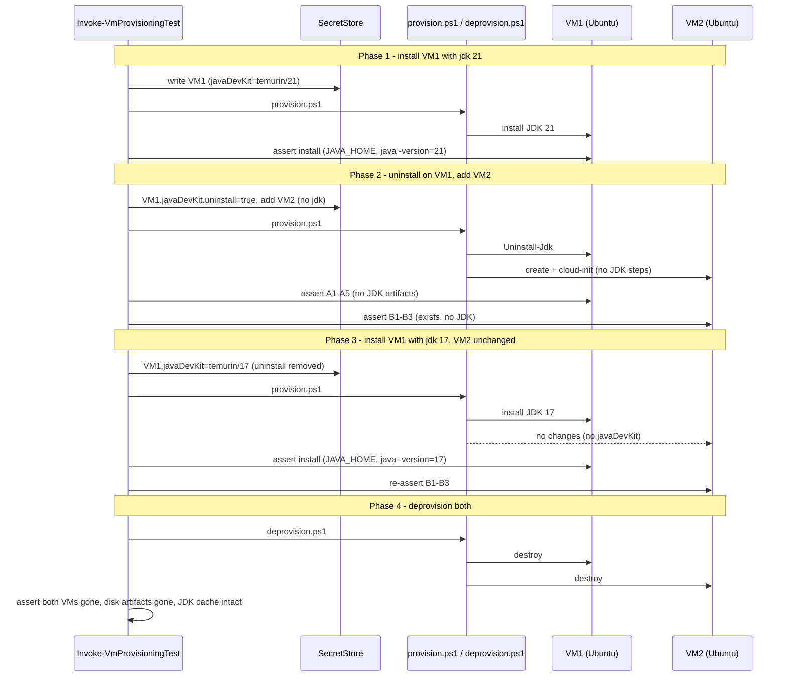

# Plan: JDK Uninstall Flag

See [problem.md](problem.md) for context, schema, and rationale.

## Index

- [Step 1 - Schema validation for `javaDevKit.uninstall`](#step-1---schema-validation-for-javadevkituninstall)
- [Step 2 - Skip host-side acquisition when uninstalling](#step-2---skip-host-side-acquisition-when-uninstalling)
- [Step 3 - `Uninstall-Jdk` step + post-provisioning dispatch](#step-3---uninstall-jdk-step--post-provisioning-dispatch)
- [Step 4 - E2E test coverage for the uninstall path](#step-4---e2e-test-coverage-for-the-uninstall-path)

---

## Step 1 - Schema validation for `javaDevKit.uninstall`

**Reason:** Fail fast on a malformed flag before any VM work begins. The
strict unknown-field check in
[Assert-JavaDevKitField.ps1](../../../../hyper-v/ubuntu/common/config/Assert-JavaDevKitField.ps1)
already rejects typos like `"unistall"` - the allow-list just grows by one
entry and gets a type check so a string `"true"` does not silently sneak
through. Keeping the validator self-contained preserves the
[05 - Step 1](../05%20-%20java%20dev%20kit/plan.md#step-1---schema-validation-for-javadevkit)
shape (one validator, independently testable, called by
`ConvertFrom-VmConfigJson`).

**Decisions locked**

- `uninstall` must be a **boolean**. Strings like `"true"` / `"false"` and
  numeric `1` / `0` are rejected. Reason: JSON has a native boolean type;
  accepting stringy forms would mean two ways to spell the same value and
  a sliding scope of "what counts as truthy".
- `vendor` and `version` stay **required** even when `uninstall=true`. Reason:
  schema uniformity (the same shape parses whether installing or
  uninstalling). The removal step ignores `version` and uses `vendor` only
  as the install-dir prefix glob, per
  [problem.md - Guest-side removal step](problem.md#guest-side-removal-step).

**Files**

- [hyper-v/ubuntu/common/config/Assert-JavaDevKitField.ps1](../../../../hyper-v/ubuntu/common/config/Assert-JavaDevKitField.ps1) -
  add `'uninstall'` to `$allowedFields`. If present, must be `[bool]`;
  otherwise throw with the field name and observed type in the message.
  No default applied here - downstream code reads
  `$Vm.javaDevKit.PSObject.Properties['uninstall']` and treats absence
  as "install".
- [Tests/common/config/Assert-JavaDevKitField.Tests.ps1](../../../../Tests/common/config/Assert-JavaDevKitField.Tests.ps1) -
  extend existing test file (do not create a parallel one - the validator
  is one function, one test file).

**Tests (unit, mocked)**

- `uninstall` absent: existing valid-config cases still pass unchanged.
- `uninstall = $true`: validator returns silently with `vendor` + `version`
  present.
- `uninstall = $false`: same - explicit false is just as valid as absence.
- `uninstall = "true"` (string): throws, message names the field and the
  expected boolean type.
- `uninstall = 1` (number): throws, same shape.
- `uninstall = $true` with `vendor` or `version` missing: still throws
  on the missing required field (uniformity check stays in force).

**Diagram**



**README update**

- In the "Optional: install a JDK" subsection, add the `uninstall` row
  to the sub-field table with type `boolean?`, default `false`, and a
  one-line description: "Set to `true` on a previously provisioned VM
  to remove the JDK on the next run. See [Removing a JDK](#removing-a-jdk)."
- Add a short "Removing a JDK" subsection right after the install
  subsection covering: set the flag, re-run `provision.ps1`, the flag
  stays after success (rationale: link to
  [problem.md - Flag stays after success](problem.md#flag-stays-after-success-idempotent)),
  delete the whole `javaDevKit` block when truly done.

---

## Step 2 - Skip host-side acquisition when uninstalling

**Reason:** No tarball is needed for the removal path, so the dispatcher
should not invoke `Invoke-JdkAcquisition` (which would hit the Adoptium API
on a cache miss). The host-side cache is left untouched - it is keyed by
`{vendor, requestedVersion}` and may be shared by other VMs that still
want the install.

**Files**

- [hyper-v/ubuntu/up/acquire/Invoke-VmAcquisitions.ps1](../../../../hyper-v/ubuntu/up/acquire/Invoke-VmAcquisitions.ps1) -
  replace
  ```ps1
  if ($Vm.PSObject.Properties['javaDevKit']) {
      Invoke-JdkAcquisition -Vm $Vm
  }
  ```
  with a check that also skips when `javaDevKit.uninstall` is `$true`.
  Single-line guard; no helper.
- [Tests/up/acquire/Invoke-VmAcquisitions.Tests.ps1](../../../../Tests/up/acquire/Invoke-VmAcquisitions.Tests.ps1) -
  extend with the two new cases below.

**Behaviour**

- `javaDevKit` absent: existing behaviour, no call.
- `javaDevKit` present, `uninstall` absent or `$false`: call
  `Invoke-JdkAcquisition` (existing path).
- `javaDevKit` present, `uninstall = $true`: skip the call. No log noise.

**Tests (unit, mocked)**

- Mock `Invoke-JdkAcquisition`.
  - VM with no `javaDevKit`: assert NOT called.
  - VM with `javaDevKit` and no `uninstall`: assert called once.
  - VM with `javaDevKit` and `uninstall = $false`: assert called once.
  - VM with `javaDevKit` and `uninstall = $true`: assert NOT called.

**Diagram**



**README update**

- In the provisioning-flow description (the same place that mentions JDK
  acquisition between disk acquisition and seed-ISO generation), add a
  parenthetical: "skipped when `javaDevKit.uninstall` is `true`".

---

## Step 3 - `Uninstall-Jdk` step + post-provisioning dispatch

**Reason:** Bring the removal onto the VM. Mirrors the
[05 - Step 5](../05%20-%20java%20dev%20kit/plan.md#step-5---out-of-band-post-provisioning-pipeline)
post-provisioning shape (one orchestrator + N self-contained step functions);
the orchestrator just gains a new dispatch branch that picks the install
vs. uninstall step based on the flag.

**Decisions locked**

- The orchestrator picks **install OR uninstall, never both**, based on
  the flag. Reason: installing-then-uninstalling in the same run is
  nonsense; uninstalling-then-installing is the operator switching their
  mind mid-edit and should go through two provision runs to keep the
  intent explicit in JSON.
- `Uninstall-Jdk` removes by **glob** (`/opt/jdk-{vendor}-*`), not by the
  `version` string in the JSON. Reason: the v1 invariant from
  [05 - Out of Scope](../05%20-%20java%20dev%20kit/problem.md#out-of-scope)
  is "one JDK per VM", so a single vendor prefix uniquely identifies the
  install; globbing keeps the step honest if the installed version drifted
  from what the JSON now says.
- `/etc/profile.d/jdk.sh` is **deleted unconditionally** (no
  content-match check), per
  [problem.md - Guest-side removal step](problem.md#guest-side-removal-step).
  Reason: the file path is provisioner-owned; an operator wanting a custom
  `JAVA_HOME` should use a different filename.
- Empty glob is a **no-op, not a failure**, per the same section.
  Reason: re-runs with the flag still set must stay green so the
  "flag stays in JSON" semantic from
  [problem.md - Flag stays after success](problem.md#flag-stays-after-success-idempotent)
  is safe.

**Files**

- `hyper-v/ubuntu/up/post/Uninstall-Jdk.ps1` (new) - the removal step.
  Takes `$SshClient` and `$Vm` (no `$Server` - nothing is staged on the
  host file server for a removal). Same self-contained shape as
  [Install-Jdk.ps1](../../../../hyper-v/ubuntu/up/post/Install-Jdk.ps1).
- [hyper-v/ubuntu/up/post/Invoke-VmPostProvisioning.ps1](../../../../hyper-v/ubuntu/up/post/Invoke-VmPostProvisioning.ps1) -
  capture `$uninstallJdk = ${function:Uninstall-Jdk}` alongside the
  existing `$installJdk` capture, and split the `if ($hasJdk)` dispatch
  into the install/uninstall branch. The `$hasJdk` predicate itself
  stays as-is (presence of the field still triggers the JDK branch -
  what changes is which step runs).
- [hyper-v/ubuntu/provision.ps1](../../../../hyper-v/ubuntu/provision.ps1) -
  dot-source the new `Uninstall-Jdk.ps1` next to `Install-Jdk.ps1`.
- `Tests/up/post/Uninstall-Jdk.Tests.ps1` (new) - shell-shape tests for
  the new step.
- [Tests/up/post/Invoke-VmPostProvisioning.Tests.ps1](../../../../Tests/up/post/Invoke-VmPostProvisioning.Tests.ps1) -
  extend dispatch tests for the new branch.

**Behaviour - `Uninstall-Jdk -SshClient -Vm`**

One SSH round-trip under `set -e`. The script must be no-op when nothing
matches (empty glob, missing files), and must remove without prompting.

Sketch (final wording lives in the new file's source):

```sh
set -e
vendor='temurin'
# Resolve the one matching install dir (if any). nullglob avoids the
# literal pattern leaking through when nothing matches.
shopt -s nullglob
install_dirs=( /opt/jdk-"$vendor"-* )
# Prune /usr/local/bin symlinks pointing into any matched dir BEFORE
# removing the dirs (after rm -rf, readlink would return a now-orphaned
# path and we would still need string matching - doing it first is
# clearer).
for d in "${install_dirs[@]}"; do
  for link in /usr/local/bin/*; do
    [ -L "$link" ] || continue
    target="$(readlink -f "$link" || true)"
    case "$target" in
      "$d"/*) sudo rm -f "$link" ;;
    esac
  done
  sudo rm -rf "$d"
done
sudo rm -f /etc/profile.d/jdk.sh
```

- Vendor is interpolated PS-side from `$Vm.javaDevKit.vendor` (single
  source of truth, same pattern as `Install-Jdk`).
- Empty glob (`nullglob`) means the `for d` loop never runs; the
  unconditional `rm -f /etc/profile.d/jdk.sh` still runs and is itself
  idempotent. Net effect: clean no-op on a VM that has no JDK.
- Throws with `$Vm.vmName` named in the message on non-zero exit, same
  shape as `Install-Jdk`.

**Behaviour - dispatch change in `Invoke-VmPostProvisioning`**

- `$hasJdk` predicate unchanged (presence of `javaDevKit`).
- Inside the closure, when `$hasJdk`:
  - If `$vmRef.javaDevKit.PSObject.Properties['uninstall']` is `$true`,
    invoke `& $uninstallJdk -SshClient $sshClient -Vm $vmRef`.
  - Otherwise, invoke `& $installJdk -SshClient $sshClient -Server $server -Vm $vmRef`
    (existing call).
- The file-server lifecycle stays as-is - it is cheap and the orchestrator
  may still need it for the `files` step in the same run.

**Tests (unit, mocked) - `Uninstall-Jdk.Tests.ps1`**

- Issued command targets `/opt/jdk-{vendor}-*` (with the configured
  vendor interpolated) and uses `nullglob` so an empty match is a no-op.
- Issued command unconditionally removes `/etc/profile.d/jdk.sh`.
- Issued command iterates `/usr/local/bin/*`, tests for symlinks, and
  removes only those whose `readlink -f` target sits inside one of the
  matched install dirs.
- Does NOT call any file-server helper (no tarball to stage).
- Throws on non-zero exit, naming the VM.

**Tests (unit, mocked) - `Invoke-VmPostProvisioning.Tests.ps1`**

- `javaDevKit` absent: neither install nor uninstall is dispatched
  (existing case, unchanged).
- `javaDevKit` present, no `uninstall`: install dispatched, uninstall NOT
  dispatched (existing case extended to also assert the negative).
- `javaDevKit` present, `uninstall = $false`: install dispatched, uninstall
  NOT dispatched.
- `javaDevKit` present, `uninstall = $true`: uninstall dispatched, install
  NOT dispatched. File server is still opened (the orchestrator opens it
  unconditionally when any opt-in field is set; this case still has the
  `javaDevKit` field present, plus `files` may also be set).
- `files` + `javaDevKit` with `uninstall = $true`: `Copy-VmFiles` runs
  before `Uninstall-Jdk` (stylistic order unchanged).

**Diagram**



**README updates**

- "Removing a JDK" subsection (introduced in Step 1) gains a sentence
  on what the step actually does on the VM: removes
  `/opt/jdk-{vendor}-*`, `/etc/profile.d/jdk.sh`, and stale
  `/usr/local/bin` symlinks pointing into the removed dir.
- Provisioning-flow numbered list: extend the post-provisioning step
  description to note the install / uninstall branch.
- File tree: add `up/post/Uninstall-Jdk.ps1` next to `Install-Jdk.ps1`.

---

## Step 4 - E2E test coverage for the uninstall path

**Reason:** Unit tests fix the dispatch logic and the issued shell
shape, but only an E2E run proves the removal actually empties the
install dir, removes the profile snippet, and prunes the symlinks on a
real VM. Extends the existing E2E scaffold from
[05 - Step 6](../05%20-%20java%20dev%20kit/plan.md#step-6---e2e-test-coverage-for-the-jdk-path)
into a four-phase scenario over two VMs so the install / uninstall /
re-install / deprovision lifecycle is covered in one run. VM identities
(`vmName`, `ipAddress`, `username`, `password`, etc.) are pinned at the
start and never change across phases - only the `javaDevKit` block on
VM1 is rewritten between phases.

Always-on (not gated on operator opt-in) so every E2E run validates
the full lifecycle.

**Decisions locked**

- **VM2 carries no `javaDevKit`** in any phase. Reason: it is the
  "blast-radius witness" - VM1's install / uninstall / re-install on
  the same provision run must never reach VM2. Giving VM2 its own JDK
  would conflate that signal with multi-JDK-install coverage, which
  belongs in a separate test.
- **VM identities are pinned for the whole scenario.** Same `vmName`
  and `ipAddress` for VM1 across phases 1-3, same for VM2 across
  phases 2-3. Reason: this is what an operator does in practice
  (edit the JSON, re-run); changing identities would test "create N
  unrelated VMs", which is not the scenario.
- **One assertion block per phase, asserted before the next phase
  edits the JSON.** Reason: a regression in phase 2 should not be
  masked by a passing phase 3.
- **No reprovision phase after deprovision.** The deprovision phase
  proves teardown is clean; reprovision after that is covered by the
  install assertions of phase 1 on any subsequent E2E run.

**Files** (live in the Infrastructure-E2E repo, not this one)

- `agent/e2e/vm-provisioning/Invoke-VmProvisioningTest.ps1` -
  - `Invoke-VmProvisioningSetup`: write a two-VM vault entry. VM1 gets
    `javaDevKit = temurin/21`; VM2 has no `javaDevKit`. Surface both
    `vmDef`s on the returned object so each phase can edit them.
  - `Invoke-VmProvisioningTest`: replace the single-pass block with the
    four-phase sequence below. Each phase opens its own SSH client(s)
    per VM, runs its assertion block, disconnects.
- `Tests/Invoke-E2EAgentLoop.Tests.ps1` - if any existing unit-level
  mock asserts the shape of the vault entry, extend it to expect the
  two-VM shape and the JSON edits between phases.

**Behaviour - phase sequence**

Each assertion throws with a clear, actionable message naming the VM
and the observed value on failure. Phase numbering matches the
sequence diagram below.

| Phase | JSON state | Action | Assertions |
|-------|-----------|--------|------------|
| 1 | VM1: `javaDevKit = temurin/21`. VM2 not in JSON. | `provision.ps1` | **On VM1:** full install assertions from [05 - Step 6](../05%20-%20java%20dev%20kit/plan.md#step-6---e2e-test-coverage-for-the-jdk-path) (JAVA_HOME under `/opt/jdk-temurin-`, `java` on PATH login + non-login, `java -version` prefix match). |
| 2 | VM1: `javaDevKit = temurin/21, uninstall = true`. VM2: added, no `javaDevKit`. | `provision.ps1` | **On VM1:** uninstall assertions A1-A5 (below). **On VM2:** existence assertions B1-B3 (below). **Blast-radius check:** VM2 must not have any `/opt/jdk-*` dir or `/etc/profile.d/jdk.sh` (VM2 never had a JDK, so this would only fire on a serious cross-VM bug). |
| 3 | VM1: `javaDevKit = temurin/17` (uninstall removed). VM2: unchanged from phase 2. | `provision.ps1` | **On VM1:** install assertions, parameterised on version `"17"` so `JAVA_HOME` starts with `/opt/jdk-temurin-17` and `java -version` output contains `"17"`. The phase-1 install dir for 21 may legitimately still exist on disk (the install step is dir-scoped, not vendor-scoped) - do NOT assert its absence here. **On VM2:** re-run B1-B3 to confirm phase 3's run on VM1 did not touch VM2. |
| 4 | (no JSON edit needed) | `deprovision.ps1` against the same JSON as phase 3 | **On host:** `Get-VM -Name VM1`, `Get-VM -Name VM2` return nothing. **On host:** the per-VM disk artifacts (VHDX, seed ISO) for both VMs are gone from `vhdPath`. Host-side JDK cache (tarball + lockfile) is left untouched - assert it is still there. |

**Assertion blocks**

VM1 uninstall (phase 2) - on `$sshClient1`:

- **A1** Install dir is gone:
  `bash -c 'ls -d /opt/jdk-temurin-* 2>/dev/null | wc -l'` produces `0`.
- **A2** Profile snippet is gone:
  `bash -c 'test -e /etc/profile.d/jdk.sh && echo present || echo absent'`
  produces `absent`.
- **A3** `JAVA_HOME` no longer set in a login shell:
  `bash -lc 'echo "${JAVA_HOME:-unset}"'` produces `unset`.
- **A4** `java` no longer on `PATH` for either shell type:
  `bash -lc 'command -v java || true'` and `bash -c 'command -v java || true'`
  both produce empty output.
- **A5** No stale `/usr/local/bin` symlinks pointing into the removed dir:
  `bash -c 'find /usr/local/bin -maxdepth 1 -type l -lname "/opt/jdk-temurin-*"'`
  produces empty output.

VM2 existence (phases 2 and 3) - on `$sshClient2`:

- **B1** VM exists and accepts SSH (covered by the SSH client opening
  successfully; explicit `hostname` check returns VM2's name).
- **B2** cloud-init finished cleanly:
  `cloud-init status` exits 0 with status `done`.
- **B3** No JDK artifacts present (blast-radius witness):
  `bash -c 'ls -d /opt/jdk-* 2>/dev/null | wc -l'` produces `0`, and
  `/etc/profile.d/jdk.sh` does not exist.

VM1 install with version `"17"` (phase 3) - on `$sshClient1`:

- Same assertions as the install block from
  [05 - Step 6](../05%20-%20java%20dev%20kit/plan.md#step-6---e2e-test-coverage-for-the-jdk-path),
  parameterised on `"17"`: `JAVA_HOME` starts with `/opt/jdk-temurin-17`,
  `command -v java` (both shell types) resolves under that `JAVA_HOME`,
  `java -version` output contains `"17"`.
- The phase-1 `/opt/jdk-temurin-21*` dir is not asserted to be present
  or absent - that is outside this feature's scope (multi-JDK
  coexistence is explicitly out of scope per
  [problem.md - Out of Scope](problem.md#out-of-scope)).

Deprovision (phase 4) - on the host:

- `Get-VM -Name $vm1.vmName -ErrorAction SilentlyContinue` returns nothing;
  same for VM2.
- The per-VM VHDX and seed ISO files under `vhdPath` for both VMs are
  absent.
- The host-side JDK cache for the versions used in phases 1 and 3 is
  still present (tarball + lockfile under `vhdPath`). Reason: the
  cache is host-owned, not VM-owned, so a deprovision must not touch it.

**Tests (no new Pester tests)**

E2E is the test layer. The mock-level unit test in
`Tests/Invoke-E2EAgentLoop.Tests.ps1` continues to cover agent-loop
plumbing without behavioural duplication of these assertions.

**Diagram**



**README update** (Infrastructure-E2E, not this repo)

- Replace the single-pass E2E description with the four-phase scenario:
  phase 1 installs JDK 21 on VM1, phase 2 uninstalls it and adds VM2
  (asserting VM2 untouched by JDK steps), phase 3 swaps VM1 to JDK 17
  and re-asserts VM2 untouched, phase 4 deprovisions both and asserts
  the host-side JDK cache is preserved. Note that VM identities are
  pinned across phases - only VM1's `javaDevKit` block changes.
