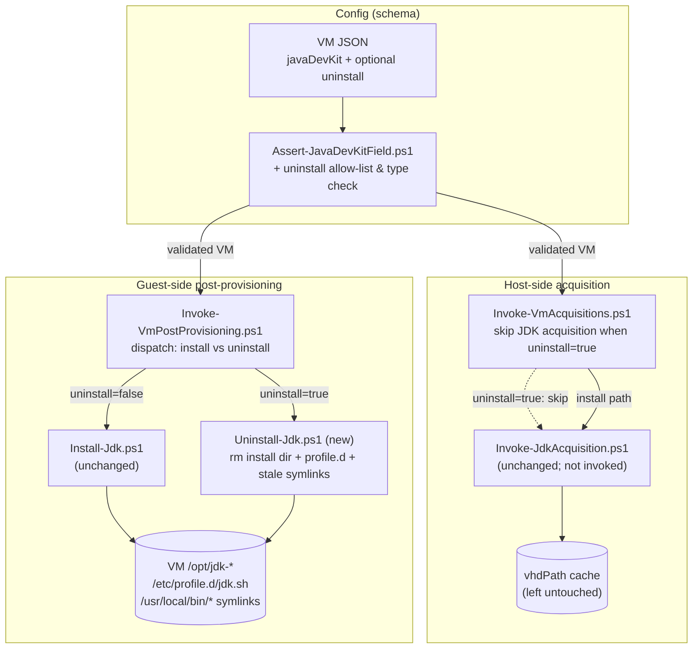
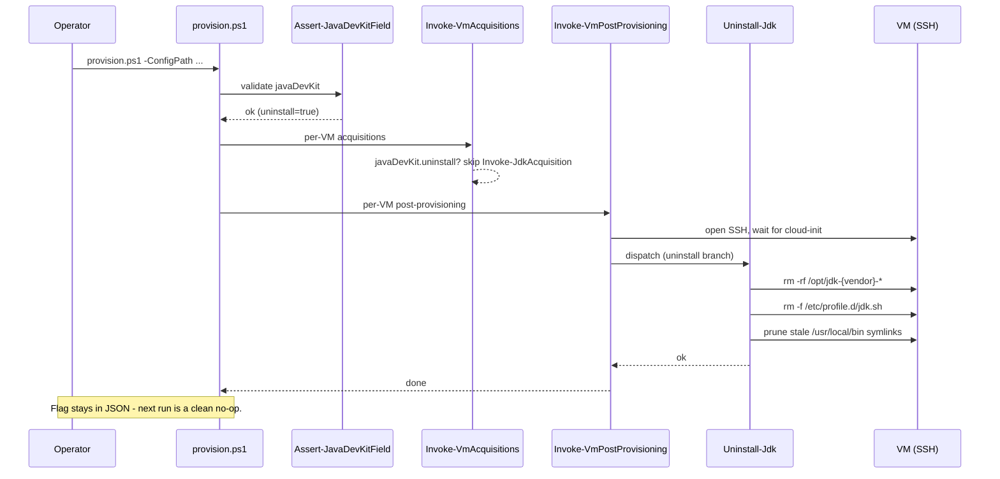

# Problem: JDK Uninstall Flag

## Index

- [Context](#context)
- [What Is Changing](#what-is-changing)
  - [New optional sub-field: `javaDevKit.uninstall`](#new-optional-sub-field-javadevkituninstall)
  - [Acquisition skipped when uninstalling](#acquisition-skipped-when-uninstalling)
  - [Guest-side removal step](#guest-side-removal-step)
  - [Flag stays after success (idempotent)](#flag-stays-after-success-idempotent)
- [Why Now](#why-now)
- [Affected Components](#affected-components)
- [Out of Scope](#out-of-scope)

---

## Context

The [05 - java dev kit](../05%20-%20java%20dev%20kit/problem.md) feature
added an optional `javaDevKit` block to a VM definition. When set, the
provisioner:

1. Resolves and caches a Temurin tarball on the host
   ([Invoke-JdkAcquisition.ps1](../../../../hyper-v/ubuntu/up/jdk/Invoke-JdkAcquisition.ps1)).
2. Streams it onto the VM and extracts to `/opt/jdk-{vendor}-{resolvedVersion}/`,
   writes `/etc/profile.d/jdk.sh`, and symlinks the JDK binaries under
   `/usr/local/bin/` ([Install-Jdk.ps1](../../../../hyper-v/ubuntu/up/post/Install-Jdk.ps1)).

The install is system-wide and reachable from both login and non-login
shells (see the comment header in `Install-Jdk.ps1` for the rationale).
That same surface area now needs a removal path so an operator can pull the
JDK back off a long-lived VM without rebuilding it.

Removal is a re-provisioning concern, not a deprovisioning concern - the
VM stays, only the JDK leaves. `deprovision.ps1` destroys the whole disk
and already handles the "VM is gone, JDK with it" case; that is not what
this feature is for.

---

## What Is Changing

### New optional sub-field: `javaDevKit.uninstall`

The `javaDevKit` object gains one optional boolean. When absent or `false`,
behaviour is unchanged (install path, as today). When `true`, the
provisioner removes the JDK from the VM on its next run.

```json
{
  "vmName": "dev-01",
  "...": "...",
  "javaDevKit": {
    "vendor":  "temurin",
    "version": "21",
    "uninstall": true
  }
}
```

| Sub-field   | Type    | Required | Notes |
|-------------|---------|----------|-------|
| `vendor`    | string  | yes      | Unchanged from [05](../05%20-%20java%20dev%20kit/problem.md). Identifies the install-dir prefix `/opt/jdk-{vendor}-*` that the removal targets. |
| `version`   | string  | yes      | Unchanged from [05](../05%20-%20java%20dev%20kit/problem.md). Kept required so the schema stays uniform whether the operator is installing or uninstalling; the removal step does not use the value (see [Guest-side removal step](#guest-side-removal-step)). |
| `uninstall` | boolean | no       | Defaults to `false`. `true` switches the post-provisioning step from install to removal. |

Validation lives in
[Assert-JavaDevKitField.ps1](../../../../hyper-v/ubuntu/common/config/Assert-JavaDevKitField.ps1)
so a malformed flag fails before any VM work begins. The strict
unknown-field check there already rejects typos like `"unistall"`; the
allow-list just grows by one entry.

### Acquisition skipped when uninstalling

[Invoke-VmAcquisitions.ps1](../../../../hyper-v/ubuntu/up/acquire/Invoke-VmAcquisitions.ps1)
currently dispatches to `Invoke-JdkAcquisition` whenever `javaDevKit` is
present. With `uninstall = true` there is no tarball to download (and no
need to hit Adoptium), so the dispatcher checks the flag and skips. The
host-side cache (tarball + lockfile) is left untouched - it belongs to a
host, not to a VM, and other VMs may still be using it.

### Guest-side removal step

[Invoke-VmPostProvisioning.ps1](../../../../hyper-v/ubuntu/up/post/Invoke-VmPostProvisioning.ps1)
gains a sibling dispatch: when `javaDevKit.uninstall` is true, it invokes
a new `Uninstall-Jdk` step instead of `Install-Jdk`. The new step
mirrors the install's responsibilities in reverse:

| Layer            | Removal action |
|------------------|----------------|
| Install root     | `rm -rf /opt/jdk-{vendor}-*` (glob - one JDK per VM is the v1 invariant from [05](../05%20-%20java%20dev%20kit/problem.md#out-of-scope), so a single vendor prefix uniquely identifies the install). |
| `JAVA_HOME` / `PATH` | `rm -f /etc/profile.d/jdk.sh` so new login shells stop exporting a dead `JAVA_HOME`. |
| `/usr/local/bin` symlinks | Iterate `/usr/local/bin/*`, delete any that are symlinks resolving into a removed `/opt/jdk-{vendor}-*` path. Plain files and symlinks pointing elsewhere are left alone. |
| Idempotency      | All operations no-op when the targets are already gone, so a second run with the flag still set is a clean no-op. |

The version sub-field is required by the schema for uniformity but is not
read by the removal script. Globbing on `/opt/jdk-{vendor}-*` keeps the
step honest if the installed version on the VM has drifted from what the
JSON now says (e.g. operator bumped the string).

### Flag stays after success (idempotent)

The provisioner does **not** rewrite the input JSON after a successful
uninstall. Rationale:

- The provisioner has never mutated operator-owned config. Starting now
  would create a new failure mode (lost comments/formatting) for one
  feature.
- Re-running with the flag still set is a clean no-op (everything is
  already gone), so leaving it does not break anything.
- The operator removes the whole `javaDevKit` block when they are truly
  done. That is one explicit edit, not two.

---

## Why Now

- A workload that needed a JDK on a long-lived VM has moved off it, and
  the JDK now needs to come off without rebuilding the VM. Today the only
  removal path is "destroy and recreate", which is overkill.
- The install path is settled and well-tested, so adding the symmetric
  removal path is a small, well-scoped delta against a known surface.
- Keeps the principle from [05](../05%20-%20java%20dev%20kit/problem.md):
  one JSON file in, reproducible VM state out - in either direction.

---

## Affected Components



Sequence on a re-provision with `uninstall = true`:



---

## Out of Scope

- Removing the host-side cache (tarball + lockfile). The cache is keyed by
  `{vendor, requestedVersion}` and may be shared by other VMs; cleaning
  it is a separate, host-level concern.
- Auto-clearing the `uninstall` flag (or the whole `javaDevKit` block)
  after success. See [Flag stays after success](#flag-stays-after-success-idempotent).
- Selective removal when multiple JDKs coexist on one VM. The v1 invariant
  from [05 - Out of Scope](../05%20-%20java%20dev%20kit/problem.md#out-of-scope)
  is "one JDK per VM", so the removal step deletes the single
  `/opt/jdk-{vendor}-*` match by glob. Multi-JDK support is a separate
  feature and would need to revisit both install and uninstall together.
- Removing JDK-related state owned by Infrastructure-Vm-Users (per-user
  shell rc files, IDE configs). The provisioner only undoes what it
  installed.
- A separate `deprovision.ps1` removal path. Destroying the VM already
  removes the JDK with the disk.
