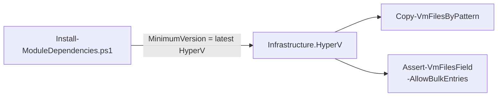
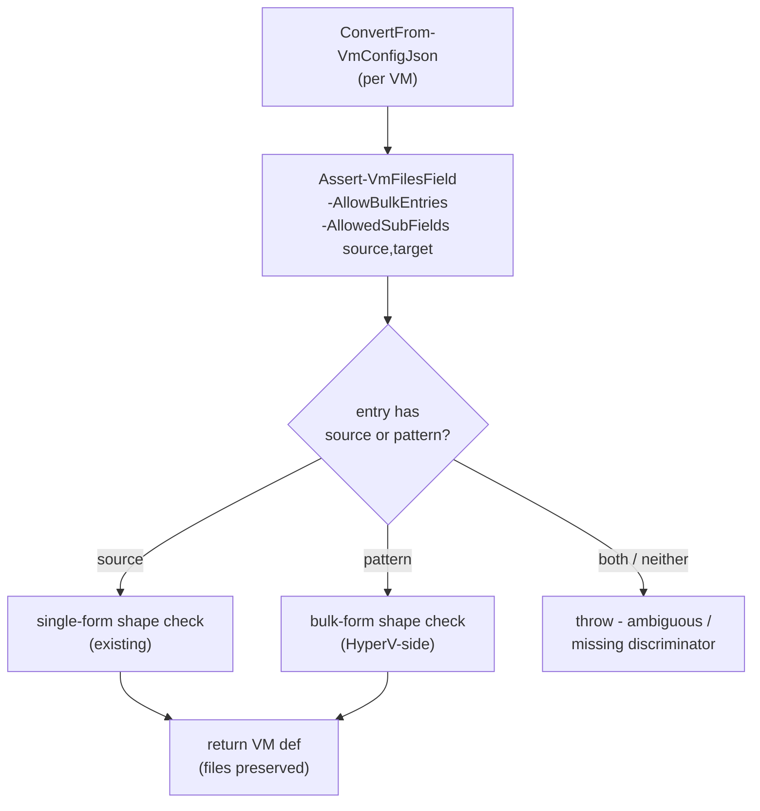
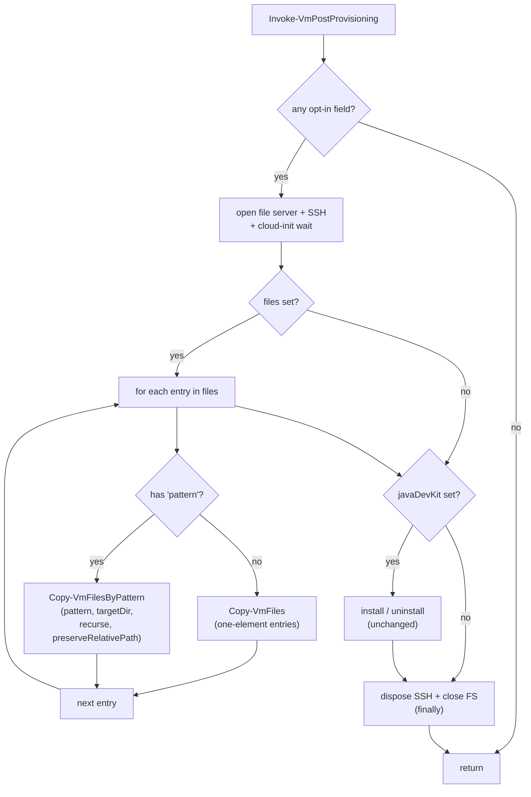

# Plan: Bulk Pattern Entries in the `files` Array

See [problem.md](problem.md) for context, schema, and rationale.

## Index

- [Step 1 - Bump Infrastructure.HyperV dependency to the latest](#step-1---bump-infrastructurehyperv-dependency-to-the-latest)
- [Step 2 - Opt into bulk entries in `ConvertFrom-VmConfigJson`](#step-2---opt-into-bulk-entries-in-convertfrom-vmconfigjson)
- [Step 3 - Per-entry dispatch in `Invoke-VmPostProvisioning`](#step-3---per-entry-dispatch-in-invoke-vmpostprovisioning)
- [Step 4 - E2E test coverage for the bulk path](#step-4---e2e-test-coverage-for-the-bulk-path)

---

## Step 1 - Bump Infrastructure.HyperV dependency to the latest

**Reason:** `Copy-VmFilesByPattern` and the `-AllowBulkEntries` switch
on
[Assert-VmFilesField](../../../../../Infrastructure-HyperV/Infrastructure.HyperV/Public/FileTransfer/Assert-VmFilesField.ps1)
were first shipped by `Infrastructure.HyperV` v0.4 - both the schema
step (Step 2) and the dispatch step (Step 3) depend on them, so the
version bump must land first or a fresh `provision.ps1` clone would
pull the previous floor and fail with a missing-cmdlet error before
any of the new code path runs. Bumping in its own commit also keeps
the diffs for Steps 2-3 focused on the provisioner-side logic.

**Decisions locked**

- Bump `-MinimumVersion` to the current `ModuleVersion` in the
  HyperV repo's
  [psd1](../../../../../Infrastructure-HyperV/Infrastructure.HyperV/Infrastructure.HyperV.psd1)
  at the time this step is implemented, not the historical "first
  version that shipped the cmdlet" (`0.4.0`). Reason: HyperV has
  shipped several additive releases since v0.4 (skip-unchanged in
  v0.6, env-var transport in v0.7, ...). Pinning to the floor we
  strictly need wastes a bump on the next feature that needs any
  later cmdlet, and the additive-only release model means newer
  versions cannot break us. The `-MinimumVersion` semantic means
  consumers automatically pick up patch / minor updates, so this
  bump is also the cheapest way to sweep in fixes.
- Keep `-MinimumVersion` (not `RequiredVersion`). Reason: the
  existing
  [Install-ModuleDependencies.ps1](../../../../hyper-v/ubuntu/Install-ModuleDependencies.ps1)
  uses `-MinimumVersion` for every dependency, so the pin style
  stays uniform.

**Files**

- [hyper-v/ubuntu/Install-ModuleDependencies.ps1](../../../../hyper-v/ubuntu/Install-ModuleDependencies.ps1) -
  raise the `Invoke-ModuleInstall -ModuleName 'Infrastructure.HyperV'`
  line's `-MinimumVersion` from `'0.3.1'` to the current HyperV
  `ModuleVersion` (read the psd1 at implementation time).

**Tests (unit, mocked)**

- No behavioural test - the bootstrap path's pinning is a
  configuration value, not logic. The change is exercised by Steps 2-4.

**Diagram**



**README update**

- In the dependency-versions section (where the current HyperV version
  is mentioned, if any), reflect the new floor. If the README does not
  pin versions, no edit is required.

---

## Step 2 - Opt into bulk entries in `ConvertFrom-VmConfigJson`

**Reason:** The schema is the first thing a misedited config hits. Wiring
the `-AllowBulkEntries` switch and widening `-AllowedSubFields` here
keeps the provisioner's policy ("both forms, both `root:root, 0644`, no
per-entry overrides") expressed once, at the call site, per
[problem.md - Validation surface](problem.md#validation-surface). The
HyperV-side validator already does all the per-form shape work
(see [Assert-VmFilesField](../../../../../Infrastructure-HyperV/Infrastructure.HyperV/Public/FileTransfer/Assert-VmFilesField.ps1)),
so this step is intentionally a small call-site change plus its tests.

**Decisions locked**

- `-AllowedSubFields` stays `@('source', 'target')`. Reason: that
  parameter only governs the **single-form** allow-list (the bulk form's
  allow-list is fixed inside `Assert-VmFilesField`). Adding the bulk
  keys here would weaken the single-form contract and let
  `{ source, pattern }` typos slip past discrimination.
- Pattern existence on the host filesystem is **not** validated here.
  Reason: per
  [problem.md - Validation surface](problem.md#validation-surface),
  the resolver inside `Copy-VmFilesByPattern` owns the "host filesystem
  agrees" check, keeping a single source of truth for host-side rules.
- `Copy-VmFiles` (the single-file transport) is already loaded as a
  module cmdlet; no new dot-source here. The validator's
  `-AllowBulkEntries` switch is the only surface change in this step.

**Files**

- [hyper-v/ubuntu/common/config/ConvertFrom-VmConfigJson.ps1](../../../../hyper-v/ubuntu/common/config/ConvertFrom-VmConfigJson.ps1) -
  add `-AllowBulkEntries` to the `Assert-VmFilesField` call. Keep
  `-AllowedSubFields @('source', 'target')` and
  `-PostEntryValidator $null` exactly as today. Update the inline
  comment to note that the provisioner opts into both forms.
- [Tests/common/config/ConvertFrom-VmConfigJson.Tests.ps1](../../../../Tests/common/config/ConvertFrom-VmConfigJson.Tests.ps1) -
  extend with the bulk-form cases below; do not duplicate the
  per-entry shape assertions that
  `Infrastructure-HyperV`'s own tests already cover for the validator.

**Tests (unit, mocked)**

Assertions target only what changes at the call site:

- A config whose `files` array contains a bulk entry
  (`{ pattern, targetDir }`) parses successfully and the bulk entry
  is preserved on the returned VM definition (round-trip - no fields
  added or dropped).
- A config mixing one single and one bulk entry parses successfully
  and both entries are preserved in order.
- A config with `{ pattern, targetDir, recurse: true, preserveRelativePath: true }`
  parses successfully (the optional booleans pass through to the VM
  object as-is for the dispatch step to read).
- Negative cases (the validator's responsibility, asserted here only
  to confirm we did opt in):
  - Entry with both `source` and `pattern`: throws.
  - Entry with neither: throws.
  - Bulk entry missing `targetDir`: throws.
  - Unknown bulk sub-field (e.g. `targetdir` typo, `recursive`): throws.
- Existing single-form valid-config cases still pass unchanged - the
  switch is additive.

**Diagram**



**README update**

- "Optional: copy files to the VM" gains a second sub-section titled
  "Bulk entries" with one example
  (`{ "pattern": "C:\\jars\\*.jar", "targetDir": "/opt/ci-jars" }`),
  the four sub-fields table from
  [problem.md - Extended `files` entry shape](problem.md#extended-files-entry-shape),
  and a link to the upstream `Copy-VmFilesByPattern` notes for
  wildcard semantics (so the schema docs do not duplicate the
  transport contract).
- Note: ownership and mode stay `root:root, 0644` for both forms,
  matching the existing single-file paragraph.

---

## Step 3 - Per-entry dispatch in `Invoke-VmPostProvisioning`

**Reason:** Once the schema accepts the bulk form, the post-provisioning
step must route each entry to the right transport. This is the only
behavioural change in the run-time path; everything else is wiring.
Per-entry dispatch (rather than partitioning into two arrays) keeps
the operator-visible order from the JSON, so log lines and any later
side effects appear in the order the operator wrote them.

**Decisions locked**

- Dispatch is **per-entry**, not "all singles then all bulks". Reason:
  preserves JSON order in logs, and the steps already share the same
  SSH session and file server so there is no batching win to chase.
- Each bulk entry becomes one `Copy-VmFilesByPattern` call. Reason:
  the resolver's zero-match error and target-collision error must
  surface per entry so the operator can fix the offending stanza
  without guessing which one of N patterns matched nothing.
- Optional booleans (`recurse`, `preserveRelativePath`) default to
  `$false` when absent on the JSON entry. Reason: matches the table
  in [problem.md - Extended `files` entry shape](problem.md#extended-files-entry-shape).
  The default is applied here at the dispatch site (not in the
  validator), so the JSON round-trip in Step 2's tests stays a pure
  pass-through.
- The file server stays opened unconditionally when any opt-in field
  is set, same as today. Reason: `Copy-VmFilesByPattern` uses the
  same host file server as `Copy-VmFiles`, so the lifecycle is
  identical.

**Files**

- [hyper-v/ubuntu/up/post/Invoke-VmPostProvisioning.ps1](../../../../hyper-v/ubuntu/up/post/Invoke-VmPostProvisioning.ps1) -
  capture `$copyVmFilesByPattern = ${function:Copy-VmFilesByPattern}`
  alongside the existing `$copyVmFiles` capture, and replace the
  current "build one array of `{Source, Target}` and call
  `Copy-VmFiles` once" block with a per-entry loop that:
  - For an entry with `source`: build a one-element `{Source, Target}`
    array and call `& $copyVmFiles` (preserves today's contract).
  - For an entry with `pattern`: read `pattern`, `targetDir`, and the
    two optional booleans, then call `& $copyVmFilesByPattern` with
    those values.
- [Tests/up/post/Invoke-VmPostProvisioning.Tests.ps1](../../../../Tests/up/post/Invoke-VmPostProvisioning.Tests.ps1) -
  extend dispatch tests for the new branch. Mock both transports.

**Behaviour - dispatch loop**

- `$hasFiles` predicate unchanged (presence + non-empty array).
- Inside the closure, when `$hasFiles`:
  - Iterate `$vmRef.files` once, in order.
  - Discriminate on `PSObject.Properties['pattern']` (presence -> bulk;
    absence -> single). Step 2's schema guarantees the entry is
    well-formed for whichever branch matches.
  - Log a per-entry one-liner naming the form and the
    source/pattern, so operator output remains useful for both forms.
- Other branches (`$hasJdk`) and the SSH / file-server lifecycle are
  untouched.

**Tests (unit, mocked) - `Invoke-VmPostProvisioning.Tests.ps1`**

Mock `Copy-VmFiles` and `Copy-VmFilesByPattern`. Assertions:

- `files` absent: neither transport called (existing case, unchanged).
- `files` = one single entry: `Copy-VmFiles` called once with a
  one-element entries array; `Copy-VmFilesByPattern` NOT called.
  (Equivalent to today's behaviour, asserted to lock the regression
  guard from
  [problem.md - Acceptance Criteria](problem.md#acceptance-criteria).)
- `files` = one bulk entry: `Copy-VmFilesByPattern` called once with
  the entry's `pattern`, `targetDir`, and `$false` for the optional
  booleans; `Copy-VmFiles` NOT called.
- `files` = one bulk entry with `recurse=true, preserveRelativePath=true`:
  `Copy-VmFilesByPattern` receives both as `$true`.
- `files` = mixed `[single, bulk, single]`: transports called in that
  order; assert call sequence (e.g. via per-mock counters or
  `Should -Invoke` `-CallNumber` checks) so JSON order is preserved.
- `files` + `javaDevKit`: `Copy-VmFiles` / `Copy-VmFilesByPattern`
  run before `Install-Jdk` / `Uninstall-Jdk` (stylistic order
  unchanged).
- A bulk entry whose `Copy-VmFilesByPattern` mock throws (simulating
  the resolver's zero-match error) propagates out of
  `Invoke-VmPostProvisioning` and the SSH client / file server are
  still disposed (covered by the existing `finally` test pattern).

**Diagram**



**README updates**

- The "Bulk entries" sub-section introduced in Step 2 gains one
  sentence noting that each bulk entry runs as its own
  `Copy-VmFilesByPattern` call, and that errors (zero matches,
  target-path collisions) are reported per entry before any SSH
  I/O for that entry happens.
- Provisioning-flow description (where the `files` step is mentioned)
  notes the per-entry dispatch in a parenthetical.

---

## Step 4 - E2E test coverage for the bulk path

**Reason:** Unit tests fix the dispatch logic; only an E2E run proves
the bulk entry actually lands every matching file under `targetDir`
with the right ownership / mode on a real VM, and that a re-run with
the same JSON is a no-op for externally visible state per
[problem.md - Acceptance Criteria](problem.md#acceptance-criteria).
Extends the existing E2E scaffold from
[05 - Step 6](../05%20-%20java%20dev%20kit/plan.md#step-6---e2e-test-coverage-for-the-jdk-path)
into a small two-phase scenario over one VM (bulk transport is already
covered by `Infrastructure-HyperV`'s integration suite; here the focus
is "the provisioner wires it correctly end-to-end").

Always-on (not gated on operator opt-in) so every E2E run validates
the bulk path.

**Decisions locked**

- **One VM, two phases.** Reason: this feature has no cross-VM
  blast-radius surface to assert (unlike
  [06 - Step 4](../06%20-%20jdk%20uninstall%20flag/plan.md#step-4---e2e-test-coverage-for-the-uninstall-path)).
  A second VM would test something this feature does not affect.
- **One bulk entry + one single entry in the same `files` array.**
  Reason: directly covers the "mixed dispatch" acceptance criterion
  on real infrastructure; no extra VM is needed to prove it.
- **Phase 2 is a no-edit re-provision.** Reason: proves the
  idempotence claim from
  [problem.md - Acceptance Criteria](problem.md#acceptance-criteria)
  (re-running with the same config is a no-op for externally visible
  state - file contents and mode unchanged).
- **No zero-match phase on E2E.** Reason: the resolver throws
  before SSH I/O, which `Infrastructure-HyperV`'s tests already
  cover; re-asserting it here would only re-test upstream code on
  slower infrastructure.

**Files** (live in the Infrastructure-E2E repo, not this one)

- `agent/e2e/vm-provisioning/Invoke-VmProvisioningTest.ps1` -
  - `Invoke-VmProvisioningSetup`: stage a small fixture directory on
    the agent host (e.g. `C:\e2e-fixtures\jars\a.jar`, `b.jar`,
    `c.jar` - three tiny files with distinguishable content). Write
    the VM's `files` array with one bulk entry pointing at
    `C:\e2e-fixtures\jars\*.jar` -> `/opt/ci-jars`, plus one single
    entry for a sentinel file (e.g.
    `C:\e2e-fixtures\seed.json` -> `/var/data/seed.json`).
  - `Invoke-VmProvisioningTest`: replace the single-pass block with
    the two-phase sequence below. Each phase opens its own SSH
    client, runs its assertion block, disconnects.
- `Tests/Invoke-E2EAgentLoop.Tests.ps1` - if any existing unit-level
  mock asserts the shape of the vault entry, extend it to expect the
  mixed `files` array.

**Behaviour - phase sequence**

Each assertion throws with a clear, actionable message naming the
VM and the observed value on failure.

| Phase | JSON state | Action | Assertions |
|-------|-----------|--------|------------|
| 1 | One VM, `files = [bulk(*.jar -> /opt/ci-jars), single(seed.json -> /var/data/seed.json)]`. | `provision.ps1` | **On VM:** bulk assertions C1-C4, single assertion C5 (below). |
| 2 | Unchanged from phase 1. | `provision.ps1` again | **On VM:** re-run C1-C5; **plus** idempotence assertions C6-C7 (file mtimes / SHA-256 unchanged versus a snapshot taken at the end of phase 1). |

**Assertion blocks**

VM bulk (phases 1 and 2):

- **C1** All three JARs landed under `/opt/ci-jars`:
  `bash -c 'ls /opt/ci-jars/*.jar 2>/dev/null | wc -l'` produces `3`,
  and the basenames `a.jar`, `b.jar`, `c.jar` are present.
- **C2** Ownership is `root:root` for every matched file:
  `bash -c 'stat -c "%U:%G" /opt/ci-jars/*.jar | sort -u'` produces
  exactly one line, `root:root`.
- **C3** Mode is `0644` for every matched file:
  `bash -c 'stat -c "%a" /opt/ci-jars/*.jar | sort -u'` produces
  exactly one line, `644`.
- **C4** File contents match host (SHA-256 of each landed file
  equals the SHA-256 of its host counterpart - asserted per file
  so a partial copy is named).

VM single (phases 1 and 2):

- **C5** `/var/data/seed.json` exists, is owned `root:root` with
  mode `0644`, and its SHA-256 matches the host sentinel.

Idempotence (phase 2):

- **C6** Bulk targets unchanged: SHA-256 of each `/opt/ci-jars/*.jar`
  equals the value captured at the end of phase 1.
- **C7** Single target unchanged: same comparison for
  `/var/data/seed.json`. (mtime is not asserted because the
  transport overwrites unconditionally; the contract from
  [problem.md - Post-provisioning dispatch](problem.md#post-provisioning-dispatch)
  is on externally visible state, not on the inode.)

**Tests (no new Pester tests)**

E2E is the test layer. The mock-level unit test in
`Tests/Invoke-E2EAgentLoop.Tests.ps1` continues to cover agent-loop
plumbing without behavioural duplication of these assertions.

**Diagram**

```mermaid
sequenceDiagram
    participant E2E as Invoke-VmProvisioningTest
    participant Host as Agent host fixtures
    participant Vault as SecretStore
    participant Prov as provision.ps1
    participant VM as VM (Ubuntu)

    Note over E2E,VM: Phase 1 - first provision (mixed files array)
    E2E->>Host: stage jars/*.jar + seed.json
    E2E->>Vault: write VM (files = [bulk, single])
    E2E->>Prov: provision.ps1
    Prov->>VM: Copy-VmFilesByPattern (jars -> /opt/ci-jars)
    Prov->>VM: Copy-VmFiles (seed.json -> /var/data/)
    E2E->>VM: assert C1-C5; snapshot SHA-256s

    Note over E2E,VM: Phase 2 - re-provision, no edits (idempotence)
    E2E->>Prov: provision.ps1
    Prov->>VM: re-copy (overwrite-in-place)
    E2E->>VM: assert C1-C5 still hold; assert C6-C7 (SHA-256s match snapshot)
```

**README update** (Infrastructure-E2E, not this repo)

- Extend the E2E description to mention the mixed-`files` scenario:
  phase 1 places three host JARs under `/opt/ci-jars` via the bulk
  entry plus a single sentinel via the existing form, asserting
  ownership / mode / content; phase 2 re-provisions with no JSON
  edit and asserts no externally visible change.
