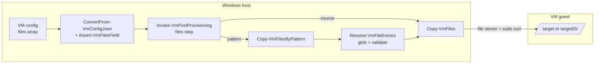

# Problem: Bulk Pattern Entries in the `files` Array

## Index

- [Context](#context)
- [What Is Changing](#what-is-changing)
  - [Extended `files` entry shape](#extended-files-entry-shape)
  - [Validation surface](#validation-surface)
  - [Post-provisioning dispatch](#post-provisioning-dispatch)
- [Why Now](#why-now)
- [Affected Components](#affected-components)
- [Out of Scope](#out-of-scope)
- [Acceptance Criteria](#acceptance-criteria)

---

## Context

`provision.ps1` validates each VM definition in
[ConvertFrom-VmConfigJson.ps1](../../../../hyper-v/ubuntu/common/config/ConvertFrom-VmConfigJson.ps1).
The `files` array is validated by
[Assert-VmFilesField](../../../../../Infrastructure-HyperV/Infrastructure.HyperV/Public/FileTransfer/Assert-VmFilesField.ps1)
in `Infrastructure.HyperV`, called with `-AllowedSubFields @('source',
'target')` to lock entries to the per-file shape the provisioner accepts
today. The post-provisioning `files` step in
[Invoke-VmPostProvisioning.ps1](../../../../hyper-v/ubuntu/up/post/Invoke-VmPostProvisioning.ps1)
forwards each entry to `Infrastructure.HyperV`'s `Copy-VmFiles`.

`Infrastructure.HyperV` v0.4 adds
[Copy-VmFilesByPattern](../../../../../Infrastructure-HyperV/Infrastructure.HyperV/Public/FileTransfer/Copy-VmFilesByPattern.ps1) -
a thin wildcard wrapper over `Copy-VmFiles` that expands a host pattern,
runs the same host-side pre-flight validation pass (zero matches,
target-path collisions, directory filtering) before touching SSH, and
forwards the entries to `Copy-VmFiles`. That wrapper is the transport this
feature needs; without it the provisioner would have to grow its own glob
layer or bloat the per-entry path with a special case.

The first concrete consumer is a Java project whose CI compiles against a
fixed set of vendor / shared JARs on the host (Maven output, a checked-out
`lib/` directory, ...). The provisioner already installs the JDK that
compiles them; this change closes the loop by also placing the classpath
inputs without enumerating every JAR in the config.

---

## What Is Changing

### Extended `files` entry shape

Each element of the `files` array stays an object; the new variant adds
keys without changing the existing one. Which transport runs per entry is
decided by which discriminating key is present:

```jsonc
{
  "vmName": "ci-01",
  "...":    "...",
  "files": [
    // Existing form - one named file. Unchanged.
    { "source": "C:\\fixtures\\seed.json", "target": "/var/data/seed.json" },

    // New form - every match of pattern lands under targetDir.
    { "pattern": "C:\\jars\\*.jar", "targetDir": "/opt/ci-jars" }
  ]
}
```

Discrimination rule: an entry with `source` is the existing single-file
form; an entry with `pattern` is the new bulk form. The two key sets are
mutually exclusive on a single entry - mixing them is a validation error
so the intent is always unambiguous.

| Entry form | Required sub-fields | Optional sub-fields | Transport |
|------------|---------------------|---------------------|-----------|
| Single file (unchanged) | `source`, `target`   | -                                  | `Copy-VmFiles` |
| Bulk pattern (new)      | `pattern`, `targetDir` | `recurse` (bool, default `false`), `preserveRelativePath` (bool, default `false`) | `Copy-VmFilesByPattern` |

| Sub-field              | Form  | Type   | Notes |
|------------------------|-------|--------|-------|
| `source`               | single | string | Windows path. Must exist at validation time. |
| `target`               | single | string | Absolute Linux path on the VM. |
| `pattern`              | bulk   | string | Host-side wildcard accepted by `Get-ChildItem -Path`. Must match at least one file when the resolver runs. |
| `targetDir`            | bulk   | string | Absolute Linux directory on the VM. |
| `recurse`              | bulk   | bool   | Descend into subdirectories. |
| `preserveRelativePath` | bulk   | bool   | Mirror the host subtree under `targetDir` instead of flattening to basenames. Useful for a Maven-style tree. |

Owner and mode stay implicit at `root:root, 0644` for every file the
provisioner writes, bulk or single - same model and same rationale as
today. The provisioner runs before any app users exist on the VM, so a
per-file owner would only surface late; the CI user that compiles against
the classpath - created later by
[Infrastructure-Vm-Users](https://github.com/VitaliiAndreev/Infrastructure-Vm-Users) -
only needs read access, which `0644` provides.

### Validation surface

`Assert-VmFilesField` in `Infrastructure.HyperV` is extended with an
opt-in switch that adds awareness of the bulk entry shape (decided in
[Infrastructure-HyperV/.../problem.md](../../../../../Infrastructure-HyperV/docs/dev/implementation/01%20-%20bulk-vm-file-transfer/problem.md);
implemented in that repo's Step 4 of the same plan). Default behaviour
is unchanged - Vm-Users and every other current consumer keeps seeing
only the single-file form. The provisioner is the first opt-in caller.

Per-entry discrimination:

- Entry with `source` => existing single-file rules (host-side
  existence check, absolute Linux target, etc).
- Entry with `pattern` => bulk-form rules (non-empty `pattern`,
  absolute Linux `targetDir`, optional `recurse` / `preserveRelativePath`
  as booleans, bulk-form sub-field allow-list to catch typos like
  `targetdir` / `recursive`).
- Entry with both keys, or neither: schema error.

`ConvertFrom-VmConfigJson` opts into the bulk form via the new switch
and otherwise keeps its current call site - the provisioner's policy
("both forms, both `root:root, 0644`, no per-entry overrides") stays
expressed at one place.

The pattern resolution check itself is **not** done in
`ConvertFrom-VmConfigJson`. It is delegated to `Copy-VmFilesByPattern`'s
resolver (`Resolve-VmFileEntries`), which already throws on zero matches
and target-path duplicates *before* any SSH I/O. Schema validation says
"the entry is well-formed"; the resolver says "the host filesystem
agrees". Splitting these keeps a single source of truth for the host-side
rules and matches the contract `Assert-VmFilesField` already establishes
for the single-file form (existence is checked elsewhere - here, by the
resolver).

### Post-provisioning dispatch

The existing `files` step in
[Invoke-VmPostProvisioning.ps1](../../../../hyper-v/ubuntu/up/post/Invoke-VmPostProvisioning.ps1)
iterates the `files` array once. Today every entry routes to
`Copy-VmFiles`. Under this change each entry is dispatched by its
discriminator:

- `source` => `Copy-VmFiles` (one-entry array, unchanged).
- `pattern` => `Copy-VmFilesByPattern` with the entry's switches.

Both calls share the same already-open SSH session and host file server.
Re-runs remain idempotent on the VM side: `curl -o` overwrites with the
current host bytes; the resolver re-globs each run so adding a JAR to the
host appears on the VM on the next provision.



---

## Why Now

- `Copy-VmFilesByPattern` ships in `Infrastructure.HyperV` v0.4 - the
  transport this feature relies on. With it, this is a small schema
  extension + one dispatch branch; without it, the provisioner would
  either bloat per-entry handling or duplicate glob logic.
- The first project consuming the CI build farm provisioned by this
  repo is a Java project. The provisioner already places the JDK;
  placing the compile classpath via the *same* `files` array (rather
  than inventing a sibling concept) keeps the user-facing surface as
  small as possible while removing the "enumerate every JAR" friction.
- Extending the existing field instead of adding a new one means
  consumers do not have to learn two near-identical features, and
  there is one re-run model to reason about.

---

## Affected Components

- [hyper-v/ubuntu/common/config/ConvertFrom-VmConfigJson.ps1](../../../../hyper-v/ubuntu/common/config/ConvertFrom-VmConfigJson.ps1) -
  add the new opt-in switch to the `Assert-VmFilesField` call and
  widen `-AllowedSubFields` to cover the bulk-form keys. Provisioner
  policy stays spelled out at the call site.
- `Infrastructure.HyperV` -
  [Assert-VmFilesField](../../../../../Infrastructure-HyperV/Infrastructure.HyperV/Public/FileTransfer/Assert-VmFilesField.ps1)
  is extended with an opt-in switch that adds bulk-entry awareness.
  Tracked and shipped on the HyperV side as
  [Step 4](../../../../../Infrastructure-HyperV/docs/dev/implementation/01%20-%20bulk-vm-file-transfer/plan.md#step-4-schema-level-bulk-entry-support-in-assert-vmfilesfield)
  of the bulk-file-transfer plan. This repo consumes the new HyperV
  version once it lands on PSGallery (`MinimumVersion` bump in the
  bootstrap path).
- [hyper-v/ubuntu/up/post/Invoke-VmPostProvisioning.ps1](../../../../hyper-v/ubuntu/up/post/Invoke-VmPostProvisioning.ps1)'s
  `files` step - dispatch each entry by its discriminator to either
  `Copy-VmFiles` or `Copy-VmFilesByPattern`. No new top-level step or
  acquisition entry.
- [README.md](../../../../README.md) -
  the "Optional: copy files to the VM" section grows a second
  sub-section describing the bulk form, with one example and a link to
  the upstream `Copy-VmFilesByPattern` notes for the wildcard semantics.
- `Tests/common/config/` and `Tests/up/post/` - extend the existing
  `files`-related unit tests for the new entry form and the dispatch
  branch. The wildcard transport itself is covered by
  `Infrastructure-HyperV`'s integration suite and is not retested here.

---

## Out of Scope

- **Per-entry owner / mode.** Both forms land `root:root, 0644`,
  matching today's `files` semantics. Per-file ownership is the
  responsibility of `Infrastructure-Vm-Users`'s `files` array, which
  runs after the CI user exists.
- **Pruning the target directory.** Re-runs overwrite matching files but
  do not remove files that were previously copied and no longer match
  the pattern. Same additive contract the single-file form has today.
  "Wipe-and-replace" is sometimes desired for JAR classpaths so removed
  JARs disappear from the VM; deliberately deferred. If it materialises
  it lands as an opt-in flag (e.g. `prune` / `clean`) on the bulk entry,
  so v1's additive contract stays the default and no current consumer
  is affected.
- **Classpath generation.** The provisioner places the JARs and stops.
  Building a `CLASSPATH` export, a `manifest.txt`, or any tool-specific
  classpath file is the consumer project's responsibility.
- **Host-side acquisition / download.** Unlike the JDK feature, files
  (single or bulk) are assumed to already exist on the host. No new
  acquirer is added to `Invoke-VmAcquisitions`.
- **Mixed single + bulk in one entry.** An entry has either `source` or
  `pattern`; combining them is a schema error so a misedited config
  cannot be silently misinterpreted.

---

## Acceptance Criteria

- A `files` array containing only single-form entries behaves bit-for-bit
  as it does today (no regression for current consumers).
- A `files` array containing one or more bulk entries parses through
  `ConvertFrom-VmConfigJson` and reaches the post-provisioning step with
  both entry forms preserved.
- Schema validation rejects, before any VM work: an entry with neither
  `source` nor `pattern`; an entry with both; missing `target` /
  `targetDir`; non-absolute `target` / `targetDir`; wrong types on
  `recurse` / `preserveRelativePath`; unknown sub-fields.
- A `pattern` that matches zero files surfaces the resolver's zero-match
  error during post-provisioning, before any SSH I/O for that entry has
  happened. Asserted via the existing mock pattern in unit tests.
- A successful run leaves every matching file under `targetDir` owned
  `root:root` with mode `0644`. Asserted in unit tests against a
  `Copy-VmFilesByPattern` mock; the transport itself is covered by
  `Infrastructure-HyperV`'s integration suite and is not retested here.
- Re-running `provision.ps1` with the same config is a no-op for the
  externally visible state of every entry's targets (file contents and
  mode unchanged) - same idempotence guarantee the single-file form
  provides.
- README documents the second entry form with one example, alongside the
  current single-file example, and links to the upstream
  `Copy-VmFilesByPattern` notes for wildcard semantics, so the schema
  docs do not duplicate the transport contract.
